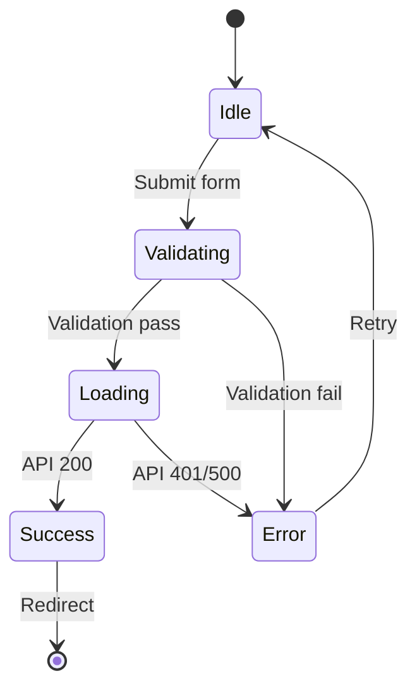
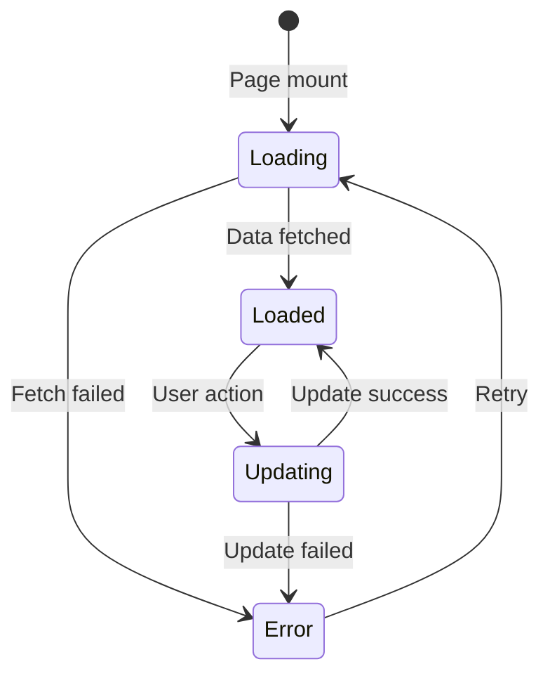

# {{PROJECT_NAME}} Screen Design

## 1. Background

### 1.1 Purpose

{{화면 설계 문서의 목적. IA에서 정의한 화면 목록을 상세하게 설계한다.}}

### 1.2 Design Specification

| Item | Value |
|------|-------|
| Responsive | Mobile-first |
| Breakpoints | 375px (Mobile), 768px (Tablet), 1280px (Desktop) |
| Component Library | Custom (packages/ui) |
| Design Token | packages/tokens |

---

## 2. Screen Definition

| Screen ID | Screen Name | Path | FR Mapping | API Endpoints | Priority |
|-----------|------------|------|------------|--------------|----------|
| S-001 | Home | `/` | - | - | Must |
| S-002 | Dashboard | `/dashboard` | FR-001 | GET /dashboard | Must |
| S-003 | {{화면명}} | `/{{path}}` | FR-002 | GET /{{resource}} | Must |
| S-004 | {{화면명}} | `/{{path}}` | FR-003 | POST /{{resource}} | Should |
| S-005 | Settings | `/settings` | - | GET /settings, PUT /settings | Must |
| S-006 | Login | `/auth/login` | FR-001 | POST /auth/login | Must |
| S-007 | Register | `/auth/register` | FR-001 | POST /auth/register | Must |

---

## 3. Screen Details

### 3.1 S-001: Home

**Layout**:
```
+------------------------------------------+
| [Header: Logo / Navigation / Auth]       |
+------------------------------------------+
| [Hero Section]                           |
|   Title                                  |
|   Description                            |
|   [CTA Button]                           |
+------------------------------------------+
| [Feature Section]                        |
|   [Card] [Card] [Card]                   |
+------------------------------------------+
| [Footer]                                 |
+------------------------------------------+
```

**Components**:

| Component | Type | Props | Description |
|-----------|------|-------|-------------|
| Header | Layout | - | 글로벌 네비게이션 |
| HeroSection | Section | title, description, ctaText | 메인 히어로 |
| FeatureCard | Card | icon, title, description | 기능 소개 카드 |
| Footer | Layout | - | 글로벌 푸터 |

### 3.2 S-006: Login

**Layout**:
```
+------------------------------------------+
| [Header]                                 |
+------------------------------------------+
|          [Login Form]                    |
|          Email: [________]               |
|          Password: [________]            |
|          [Login Button]                  |
|          [Register Link]                 |
|          [Forgot Password Link]          |
+------------------------------------------+
```

**Components**:

| Component | Type | Props | Description |
|-----------|------|-------|-------------|
| LoginForm | Form | onSubmit | 로그인 폼 |
| EmailInput | Input | value, onChange, error | 이메일 입력 |
| PasswordInput | Input | value, onChange, error | 비밀번호 입력 |
| SubmitButton | Button | loading, disabled | 제출 버튼 |

**API Mapping**:
- Submit → `POST /auth/login`
- Success → Redirect to `/dashboard`
- Error → Show error message

### 3.3 S-002: Dashboard

**Layout**:
```
+------------------------------------------+
| [Header]                                 |
+------------------------------------------+
| [Sidebar]  | [Main Content]             |
|            |   [Summary Cards]           |
|            |   [Card][Card][Card]         |
|            |                             |
|            |   [Data Table / List]       |
|            |   [Row]                     |
|            |   [Row]                     |
|            |   [Pagination]              |
+------------------------------------------+
```

**Components**:

| Component | Type | Props | Description |
|-----------|------|-------|-------------|
| Sidebar | Navigation | menuItems, activeItem | 사이드바 네비게이션 |
| SummaryCard | Card | title, value, icon | 요약 정보 카드 |
| DataTable | Table | columns, data, pagination | 데이터 테이블 |
| Pagination | Navigation | page, totalPages, onChange | 페이지네이션 |

---

## 4. State Changes

### 4.1 Login State



### 4.2 {{Screen}} State



---

## 5. Exception Handling

| # | Screen | Exception Case | UI Handling |
|---|--------|---------------|------------|
| E-001 | S-006 | 잘못된 로그인 정보 | 에러 메시지 표시 ("이메일 또는 비밀번호가 일치하지 않습니다") |
| E-002 | S-006 | 네트워크 에러 | 에러 메시지 표시 + 재시도 버튼 |
| E-003 | S-002 | 데이터 로딩 실패 | Skeleton UI → 에러 메시지 + 재시도 |
| E-004 | ALL | 인증 만료 | 로그인 페이지로 리다이렉트 |
| E-005 | {{Screen}} | {{예외}} | {{UI 처리}} |

---

## 6. Data Specification

| Screen | Data Source | Fields | Refresh |
|--------|-----------|--------|---------|
| S-002 | GET /dashboard | summary, recentItems | On mount + 30s interval |
| S-003 | GET /{{resource}} | list, pagination | On mount + page change |
| S-006 | POST /auth/login | token, user | On submit |

---

## Change Log

| Version | Date | Author | Description |
|---------|------|--------|-------------|
| v0.1.0 | {{DATE}} | u-UX | Initial draft |
