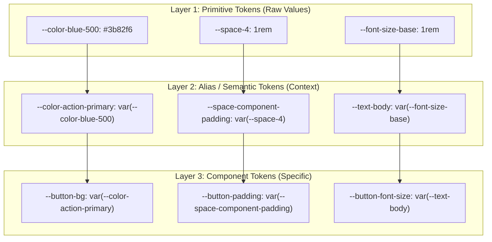
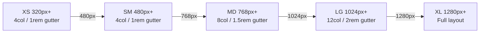
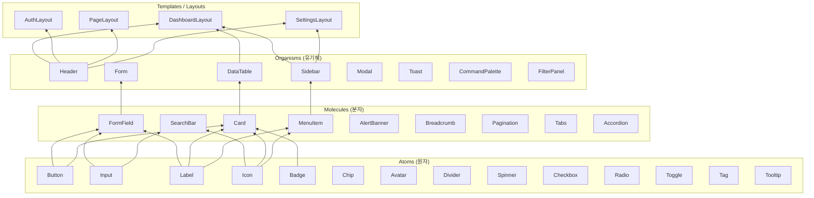
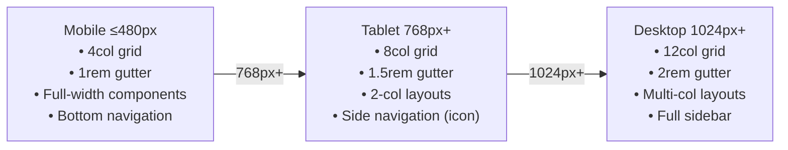

# {{PROJECT_NAME}} UX Guide & Design System

## 1. Foundation

### 1.1 Design DNA

브랜드의 시각적 언어와 디자인 철학을 정의한다.

| Dimension | Value | Description |
|-----------|-------|-------------|
| **Brand Personality** | {{Adjective 1, Adjective 2, Adjective 3}} | 예: Modern, Trustworthy, Efficient |
| **Visual Language** | {{Minimal / Bold / Playful / Professional}} | 전체 시각 방향 |
| **Tone** | {{Formal / Conversational / Technical}} | 커뮤니케이션 스타일 |
| **Target User** | {{대상 사용자 프로필}} | 디자인 결정의 기준점 |

### 1.2 Design Principles

| # | Principle | Do | Don't |
|---|-----------|-----|-------|
| 1 | **Clarity** | 명확한 계층과 레이블 | 불필요한 시각적 장식 |
| 2 | **Consistency** | 동일 패턴 → 동일 컴포넌트 | 유사하지만 다른 컴포넌트 중복 |
| 3 | **Accessibility** | WCAG 2.1 AA 준수, 충분한 대비 | 색상만으로 정보 전달 |
| 4 | **Efficiency** | 최소 클릭으로 목표 달성 | 불필요한 단계 추가 |
| 5 | **Responsiveness** | Mobile-first, 유연한 레이아웃 | 고정 픽셀 레이아웃 |

### 1.3 Accessibility Standards

| Criterion | Standard | Level | Tool |
|-----------|----------|-------|------|
| Color Contrast (Text) | 4.5:1 이상 (일반), 3:1 이상 (Large) | AA | Contrast Checker |
| Color Contrast (UI) | 3:1 이상 | AA | Contrast Checker |
| Keyboard Navigation | 모든 인터랙션 키보드로 가능 | AA | Manual test |
| Focus Indicator | 명확한 포커스 링 (2px 이상) | AA | Visual check |
| Touch Target | 최소 44×44px | AA | Design spec |
| Motion | `prefers-reduced-motion` 지원 | AA | CSS check |
| Screen Reader | 의미론적 HTML + ARIA | AA | NVDA / VoiceOver |

---

## 2. Token Architecture

디자인 토큰은 3계층 구조로 정의된다. `3_DesignToken_UX.md`에 실제 값이 정의된다.



| Layer | 역할 | 명명 패턴 | 직접 사용 |
|-------|------|----------|----------|
| **Primitive** | 원시값 정의 (팔레트, 스케일) | `--{category}-{scale}` | ❌ 컴포넌트에서 직접 사용 금지 |
| **Alias** | 의미론적 역할 부여 | `--{role}-{variant}` | ⚠️ 테마/전역 스타일에서만 |
| **Component** | 컴포넌트별 세부 제어 | `--{component}-{property}` | ✅ 컴포넌트 내부에서만 |

---

## 3. Color System

### 3.1 Brand Color Scale

각 브랜드 색상은 11단계 스케일(50~950)로 정의한다.

| Token | Value | Contrast on White | Contrast on Black |
|-------|-------|-------------------|-------------------|
| `--color-primary-50` | {{#HEX}} | — | — |
| `--color-primary-100` | {{#HEX}} | — | — |
| `--color-primary-200` | {{#HEX}} | — | — |
| `--color-primary-300` | {{#HEX}} | — | — |
| `--color-primary-400` | {{#HEX}} | — | — |
| `--color-primary-500` | {{#HEX}} | ≥ 4.5:1 (AA) | — |
| `--color-primary-600` | {{#HEX}} | ≥ 4.5:1 (AA) | — |
| `--color-primary-700` | {{#HEX}} | ≥ 4.5:1 (AAA) | — |
| `--color-primary-800` | {{#HEX}} | — | ≥ 4.5:1 (AA) |
| `--color-primary-900` | {{#HEX}} | — | ≥ 4.5:1 (AA) |
| `--color-primary-950` | {{#HEX}} | — | ≥ 4.5:1 (AAA) |

### 3.2 Semantic Color Aliases

| Alias Token | Primitive Reference | Light Mode | Dark Mode | Usage |
|-------------|-------------------|------------|-----------|-------|
| `--color-action-primary` | `--color-primary-600` | `#{{HEX}}` | `#{{HEX}}` | 주요 버튼, 링크 |
| `--color-action-primary-hover` | `--color-primary-700` | `#{{HEX}}` | `#{{HEX}}` | 호버 상태 |
| `--color-action-primary-active` | `--color-primary-800` | `#{{HEX}}` | `#{{HEX}}` | 클릭 상태 |
| `--color-action-secondary` | `--color-secondary-500` | `#{{HEX}}` | `#{{HEX}}` | 보조 액션 |
| `--color-statu-skill-success` | `--color-green-600` | `#{{HEX}}` | `#{{HEX}}` | 성공, 완료 |
| `--color-statu-skill-warning` | `--color-amber-500` | `#{{HEX}}` | `#{{HEX}}` | 경고 |
| `--color-statu-skill-error` | `--color-red-600` | `#{{HEX}}` | `#{{HEX}}` | 에러, 실패 |
| `--color-statu-skill-info` | `--color-blue-500` | `#{{HEX}}` | `#{{HEX}}` | 정보 |
| `--color-surface-primary` | `--color-neutral-0` | `#FFFFFF` | `#{{HEX}}` | 메인 배경 |
| `--color-surface-secondary` | `--color-neutral-50` | `#{{HEX}}` | `#{{HEX}}` | 카드, 패널 |
| `--color-surface-tertiary` | `--color-neutral-100` | `#{{HEX}}` | `#{{HEX}}` | 비활성 영역 |
| `--color-text-primary` | `--color-neutral-900` | `#{{HEX}}` | `#{{HEX}}` | 본문 텍스트 |
| `--color-text-secondary` | `--color-neutral-600` | `#{{HEX}}` | `#{{HEX}}` | 보조 텍스트 |
| `--color-text-disabled` | `--color-neutral-400` | `#{{HEX}}` | `#{{HEX}}` | 비활성 텍스트 |
| `--color-border-default` | `--color-neutral-200` | `#{{HEX}}` | `#{{HEX}}` | 기본 테두리 |
| `--color-border-focus` | `--color-primary-500` | `#{{HEX}}` | `#{{HEX}}` | 포커스 링 |
| `--color-border-error` | `--color-red-500` | `#{{HEX}}` | `#{{HEX}}` | 에러 테두리 |

### 3.3 Dark Mode Strategy

| Strategy | Choice | Reason |
|----------|--------|--------|
| 반전 방식 | {{True Inversion / Darkened Surface}} | {{선택 이유}} |
| 적용 방법 | `data-theme="dark"` attribute | CSS selector 기반 테마 전환 |
| 자동 감지 | `prefers-color-scheme: dark` | 시스템 설정 연동 |

---

## 4. Typography System

### 4.1 Font Stack

| Token | Stack | Fallback | Usage |
|-------|-------|----------|-------|
| `--font-sans` | `"{{Primary Font}}", {{Secondary}}` | `system-ui, -apple-system, sans-serif` | 본문, UI |
| `--font-display` | `"{{Display Font}}"` | `var(--font-sans)` | 헤딩, 마케팅 |
| `--font-mono` | `"{{Mono Font}}"` | `"Fira Code", "Consolas", monospace` | 코드, 데이터 |

**Font Loading 전략**: `font-display: swap` + preload 상위 폰트

### 4.2 Type Scale (Fluid Typography)

| Token | Base Size | Fluid Min | Fluid Max | Weight | Line Height | Tracking | Usage |
|-------|-----------|-----------|-----------|--------|-------------|---------|-------|
| `--text-display-2xl` | 4.5rem | 3rem | 4.5rem | 800 | 1.1 | -0.02em | 히어로 제목 |
| `--text-display-xl` | 3.75rem | 2.5rem | 3.75rem | 700 | 1.1 | -0.02em | 페이지 제목 |
| `--text-display-lg` | 3rem | 2rem | 3rem | 700 | 1.15 | -0.01em | 섹션 제목 |
| `--text-h1` | 2.25rem | 1.875rem | 2.25rem | 700 | 1.2 | -0.01em | H1 |
| `--text-h2` | 1.875rem | 1.5rem | 1.875rem | 600 | 1.25 | -0.005em | H2 |
| `--text-h3` | 1.5rem | 1.25rem | 1.5rem | 600 | 1.3 | 0 | H3 |
| `--text-h4` | 1.25rem | 1.125rem | 1.25rem | 600 | 1.35 | 0 | H4 |
| `--text-body-lg` | 1.125rem | 1rem | 1.125rem | 400 | 1.6 | 0 | 리드 텍스트 |
| `--text-body` | 1rem | 1rem | 1rem | 400 | 1.5 | 0 | 본문 |
| `--text-body-sm` | 0.875rem | 0.875rem | 0.875rem | 400 | 1.4 | 0 | 보조 텍스트 |
| `--text-caption` | 0.75rem | 0.75rem | 0.75rem | 400 | 1.4 | 0.01em | 캡션, 라벨 |
| `--text-overline` | 0.6875rem | 0.6875rem | 0.6875rem | 600 | 1.4 | 0.08em | 오버라인 (대문자) |

### 4.3 Semantic Typography Roles

| Role | Token | Usage |
|------|-------|-------|
| Page Title | `--text-h1` | 페이지 최상단 제목 |
| Section Title | `--text-h2` | 주요 섹션 |
| Card Title | `--text-h4` | 카드, 위젯 제목 |
| Body | `--text-body` | 본문 내용 |
| Label | `--text-body-sm` + 500 weight | Form 레이블 |
| Helper Text | `--text-caption` | 입력 힌트, 에러 메시지 |
| Button | `--text-body-sm` + 600 weight | 버튼 텍스트 |

---

## 5. Spacing System

### 5.1 Base Unit

**Base**: `4px (0.25rem)` — 모든 간격은 4px의 배수

### 5.2 Spacing Scale

| Token | rem | px | Semantic Name | Usage |
|-------|-----|----|--------------|-------|
| `--space-0` | 0 | 0 | — | Reset |
| `--space-px` | — | 1px | hairline | 경계선 보정 |
| `--space-0-5` | 0.125rem | 2px | nano | 인라인 미세 조정 |
| `--space-1` | 0.25rem | 4px | xxs | 아이콘-텍스트 간격 |
| `--space-2` | 0.5rem | 8px | xs | 관련 요소 그룹 내 |
| `--space-3` | 0.75rem | 12px | sm | 소형 컴포넌트 패딩 |
| `--space-4` | 1rem | 16px | md | 기본 내부 패딩 |
| `--space-5` | 1.25rem | 20px | — | 버튼 수직 패딩 |
| `--space-6` | 1.5rem | 24px | lg | 컴포넌트 간 |
| `--space-8` | 2rem | 32px | xl | 섹션 내부 패딩 |
| `--space-10` | 2.5rem | 40px | 2xl | 주요 컴포넌트 간 |
| `--space-12` | 3rem | 48px | 3xl | 섹션 간 |
| `--space-16` | 4rem | 64px | 4xl | 페이지 섹션 간 |
| `--space-20` | 5rem | 80px | 5xl | 페이지 영역 간 |
| `--space-24` | 6rem | 96px | 6xl | 히어로 영역 |

### 5.3 Functional Spacing Aliases

| Alias Token | Value | Usage |
|-------------|-------|-------|
| `--space-inline-xs` | `var(--space-2)` | 인라인 요소 간 (icon + label) |
| `--space-stack-sm` | `var(--space-2)` | 수직 스택 (tight) |
| `--space-stack-md` | `var(--space-4)` | 수직 스택 (normal) |
| `--space-inset-sm` | `var(--space-3)` | 소형 컴포넌트 내부 패딩 |
| `--space-inset-md` | `var(--space-4)` | 일반 컴포넌트 내부 패딩 |
| `--space-inset-lg` | `var(--space-6)` | 대형 컴포넌트 내부 패딩 |
| `--space-section` | `var(--space-12)` | 페이지 섹션 분리 |
| `--space-page` | `var(--space-16)` | 페이지 수직 패딩 |

---

## 6. Shape & Elevation

### 6.1 Border Radius

| Token | Value | Usage |
|-------|-------|-------|
| `--radiu-skill-none` | 0 | 테이블, 구분선 |
| `--radiu-skill-xs` | 2px | 소형 Badge, 태그 |
| `--radiu-skill-sm` | 4px | 버튼(sm), 칩 |
| `--radiu-skill-md` | 6px | 기본 버튼, 입력 필드 |
| `--radiu-skill-lg` | 8px | 카드, 패널 |
| `--radiu-skill-xl` | 12px | 모달, 드로어 |
| `--radiu-skill-2xl` | 16px | 대형 카드, 이미지 |
| `--radiu-skill-full` | 9999px | 아바타, 토글, 알약형 |

### 6.2 Border Width

| Token | Value | Usage |
|-------|-------|-------|
| `--border-0` | 0 | 경계 없음 |
| `--border-1` | 1px | 기본 (input, card) |
| `--border-2` | 2px | 강조 (focus, selected) |
| `--border-4` | 4px | 구분선 강조 |

### 6.3 Elevation (Shadow)

| Token | Value | Z-Index | Usage |
|-------|-------|---------|-------|
| `--elevation-0` | `none` | 0 | Flat surface |
| `--elevation-1` | `0 1px 2px rgba(0,0,0,0.05), 0 1px 3px rgba(0,0,0,0.1)` | 1 | Card, Chip |
| `--elevation-2` | `0 4px 6px rgba(0,0,0,0.05), 0 2px 4px rgba(0,0,0,0.06)` | 10 | Dropdown, Popover |
| `--elevation-3` | `0 10px 15px rgba(0,0,0,0.05), 0 4px 6px rgba(0,0,0,0.05)` | 20 | Drawer, Sheet |
| `--elevation-4` | `0 20px 25px rgba(0,0,0,0.05), 0 8px 10px rgba(0,0,0,0.04)` | 30 | Modal |
| `--elevation-5` | `0 25px 50px rgba(0,0,0,0.12)` | 50 | Toast, Tooltip |

### 6.4 Z-Index Scale

| Token | Value | Layer |
|-------|-------|-------|
| `--z-base` | 0 | 기본 콘텐츠 |
| `--z-raised` | 1 | 카드, 호버 강조 |
| `--z-dropdown` | 10 | 드롭다운, 팝오버 |
| `--z-sticky` | 20 | Sticky 헤더 |
| `--z-fixed` | 30 | Fixed 네비게이션 |
| `--z-drawer` | 40 | 사이드 드로어 |
| `--z-modal` | 50 | 모달, 다이얼로그 |
| `--z-toast` | 60 | 토스트, 스낵바 |
| `--z-tooltip` | 70 | 툴팁 |

---

## 7. Motion System

### 7.1 Duration Scale

| Token | Value | Usage |
|-------|-------|-------|
| `--duration-instant` | 0ms | 즉각 반응 (키보드 입력) |
| `--duration-fast` | 100ms | 마이크로 인터랙션 (호버, 포커스) |
| `--duration-normal` | 200ms | 대부분의 UI 전환 |
| `--duration-slow` | 300ms | 패널, 아코디언 |
| `--duration-slower` | 400ms | 모달 등장/퇴장 |
| `--duration-slowest` | 600ms | 페이지 전환, 히어로 애니메이션 |

### 7.2 Easing Curves

| Token | Value | Usage |
|-------|-------|-------|
| `--ease-linear` | `linear` | 진행 바, 로딩 |
| `--ease-in` | `cubic-bezier(0.4, 0, 1, 1)` | 퇴장 (사라지는) 전환 |
| `--ease-out` | `cubic-bezier(0, 0, 0.2, 1)` | 등장 (나타나는) 전환 |
| `--ease-in-out` | `cubic-bezier(0.4, 0, 0.2, 1)` | 위치 이동, 크기 변화 |
| `--ease-spring` | `cubic-bezier(0.175, 0.885, 0.32, 1.275)` | 탄성 효과 (선택적) |

### 7.3 Animation Patterns

| Pattern | Duration | Easing | Usage |
|---------|----------|--------|-------|
| Fade In | `--duration-normal` | `--ease-out` | 콘텐츠 등장 |
| Fade Out | `--duration-fast` | `--ease-in` | 콘텐츠 퇴장 |
| Slide Up | `--duration-slow` | `--ease-out` | 모달, Sheet 등장 |
| Slide Down | `--duration-normal` | `--ease-in` | 드롭다운 |
| Scale In | `--duration-normal` | `--ease-spring` | 팝오버 |
| Skeleton | 1.5s loop | `linear` | Loading 상태 |

### 7.4 Reduced Motion

```css
@media (prefers-reduced-motion: reduce) {
  * {
    animation-duration: 0.01ms !important;
    transition-duration: 0.01ms !important;
  }
}
```

---

## 8. Layout System

### 8.1 Breakpoints

| Token | Value | Range | Device |
|-------|-------|-------|--------|
| `--bp-xs` | 320px | 320–479px | 소형 스마트폰 |
| `--bp-sm` | 480px | 480–767px | 스마트폰 |
| `--bp-md` | 768px | 768–1023px | 태블릿 |
| `--bp-lg` | 1024px | 1024–1279px | 소형 노트북 |
| `--bp-xl` | 1280px | 1280–1535px | 데스크탑 |
| `--bp-2xl` | 1536px | 1536px+ | 광폭 모니터 |

### 8.2 Container Sizes

| Token | Max Width | Gutter | Usage |
|-------|-----------|--------|-------|
| `--container-sm` | 640px | 1rem | 소형 폼, 다이얼로그 |
| `--container-md` | 768px | 1.5rem | 기사, 블로그 |
| `--container-lg` | 1024px | 2rem | 대시보드 콘텐츠 |
| `--container-xl` | 1280px | 2rem | 페이지 최대 너비 |
| `--container-full` | 100% | 1rem | 전폭 레이아웃 |

### 8.3 Grid System

| Property | Mobile (< 768px) | Tablet (768–1023px) | Desktop (≥ 1024px) |
|----------|------------------|--------------------|--------------------|
| Columns | 4 | 8 | 12 |
| Gutter | 1rem (16px) | 1.5rem (24px) | 2rem (32px) |
| Margin | 1rem | 1.5rem | auto |

### 8.4 Breakpoint Flow



---

## 9. Component Library

### 9.1 Component Hierarchy (Atomic Design)



### 9.2 Component Catalog

| Component | Level | Variants | States | Storybook | Status |
|-----------|-------|----------|--------|-----------|--------|
| Button | Atom | primary, secondary, outline, ghost, danger, link | default, hover, focus, active, disabled, loading | Y | {{STATUS}} |
| Input | Atom | text, email, password, number, textarea, search | default, focus, error, disabled, readonly | Y | {{STATUS}} |
| Label | Atom | default, required, optional | — | Y | {{STATUS}} |
| Icon | Atom | — (icon set 기반) | — | Y | {{STATUS}} |
| Badge | Atom | default, success, warning, error, info | — | Y | {{STATUS}} |
| Chip | Atom | default, selected, removable | default, hover, active | Y | {{STATUS}} |
| Avatar | Atom | image, initials, icon | — | Y | {{STATUS}} |
| Checkbox | Atom | — | unchecked, checked, indeterminate, disabled | Y | {{STATUS}} |
| Radio | Atom | — | unchecked, checked, disabled | Y | {{STATUS}} |
| Toggle | Atom | sm, md, lg | off, on, disabled | Y | {{STATUS}} |
| Spinner | Atom | sm, md, lg | — | Y | {{STATUS}} |
| FormField | Molecule | — | default, error, success, disabled | Y | {{STATUS}} |
| SearchBar | Molecule | default, with-filters | — | Y | {{STATUS}} |
| Card | Molecule | default, interactive, media, summary | default, hover, selected | Y | {{STATUS}} |
| AlertBanner | Molecule | info, success, warning, error | — | Y | {{STATUS}} |
| Tabs | Molecule | horizontal, vertical | default, active, disabled | Y | {{STATUS}} |
| Accordion | Molecule | single, multiple | collapsed, expanded | Y | {{STATUS}} |
| Header | Organism | default, compact | — | Y | {{STATUS}} |
| Sidebar | Organism | expanded, collapsed | — | Y | {{STATUS}} |
| DataTable | Organism | default, sortable, selectable, paginated | — | Y | {{STATUS}} |
| Form | Organism | — | idle, submitting, success, error | Y | {{STATUS}} |
| Modal | Organism | default, confirmation, form, fullscreen | — | Y | {{STATUS}} |
| Toast | Organism | info, success, warning, error | entering, visible, leaving | Y | {{STATUS}} |
| {{Component}} | {{Level}} | {{Variants}} | {{States}} | Y | {{STATUS}} |

---

## 10. Component States System

모든 인터랙티브 컴포넌트는 아래 상태 모델을 준수한다.

### 10.1 Universal State Definitions

| State | Trigger | Visual Change | Token Reference |
|-------|---------|---------------|----------------|
| **Default** | 초기 상태 | 기준 스타일 | `--{component}-bg`, `--{component}-color` |
| **Hover** | 마우스 오버 | 배경색 변경, 커서 변경 | `--{component}-bg-hover` |
| **Focus** | 키보드 탭, 클릭 | 포커스 링 (2px, offset 2px) | `--color-border-focus` |
| **Active** | 클릭/탭 중 | 눌린 효과 (scale, 색 강화) | `--{component}-bg-active` |
| **Disabled** | `disabled` prop | 불투명도 0.4, 커서 not-allowed | `--color-text-disabled` |
| **Loading** | 비동기 처리 중 | Spinner 또는 skeleton | `--duration-normal` |
| **Error** | 검증 실패 | 빨간 테두리/텍스트 | `--color-border-error`, `--color-statu-skill-error` |
| **Success** | 검증 성공 | 초록 테두리/아이콘 | `--color-statu-skill-success` |
| **Selected** | 선택됨 | Primary 색 강조 | `--color-action-primary` |
| **Indeterminate** | 부분 선택 (Checkbox) | 대시 아이콘 | `--color-action-primary` |

### 10.2 State Transition Diagram

```mermaid
stateDiagram-v2
    [*] --> Default
    Default --> Hover : mouseenter
    Hover --> Default : mouseleave
    Hover --> Active : mousedown
    Active --> Hover : mouseup (no action)
    Active --> Loading : click (async)
    Active --> Error : validation fail
    Active --> Success : validation pass / submit success
    Default --> Focus : tab key
    Focus --> Default : blur
    Focus --> Active : Enter/Space
    Loading --> Default : complete
    Loading --> Error : fail
    Error --> Default : user corrects
    Success --> Default : timeout / close
    Default --> Disabled : prop change
    Disabled --> Default : prop change
```

---

## 11. Interaction Patterns

### 11.1 Form Patterns

| Pattern | Rule |
|---------|------|
| Inline Validation | 포커스 이탈(blur) 시 즉시 검증 |
| Submit Validation | 폼 전체 검증 후 첫 번째 에러 필드로 포커스 이동 |
| Error Message | 필드 하단 `--text-caption` 크기, `--color-statu-skill-error` 색상 |
| Loading State | Submit 버튼 → Spinner + "처리 중..." 텍스트 |
| Success Feedback | Toast 또는 인라인 성공 메시지 |

### 11.2 Navigation Patterns

| Pattern | Usage | Animation |
|---------|-------|-----------|
| Page Transition | 페이지 이동 | Fade (200ms) |
| Tab Switch | 탭 전환 | Slide + Fade (200ms) |
| Sidebar Toggle | 사이드바 열기/닫기 | Slide (300ms, ease-out) |
| Modal | 모달 열기/닫기 | Scale + Fade (250ms) |
| Dropdown | 드롭다운 | Slide Down (150ms) |
| Toast | 알림 등장 | Slide Up (200ms) + Auto-dismiss |

### 11.3 Feedback Patterns

| Event | Feedback Type | Duration |
|-------|--------------|----------|
| Save Success | Toast (success) | 3초 후 자동 닫힘 |
| Delete Confirm | Confirmation Modal | 사용자 확인 필요 |
| API Error | Toast (error) + Inline Error | 5초 자동 닫힘 |
| Progress | Progress Bar / Spinner | 작업 완료 시까지 |
| Empty State | Illustration + CTA | 영구 |

---

## 12. Iconography

### 12.1 Icon System

| Property | Value |
|----------|-------|
| **Icon Set** | {{Lucide / Heroicons / Phosphor / Custom SVG}} |
| **Format** | SVG (React component 방식) |
| **Size Scale** | 12px, 16px, 20px, 24px, 32px |
| **Default Size** | 20px (1.25rem) |
| **Stroke Width** | 1.5px (일반), 2px (강조) |
| **Usage** | `<Icon name="..." size={20} />` |

### 12.2 Icon Categories

| Category | Usage | Count |
|----------|-------|-------|
| Navigation | 메뉴, 방향, 탐색 | {{N}} |
| Action | 편집, 삭제, 추가, 공유 | {{N}} |
| Status | 성공, 경고, 에러, 정보 | {{N}} |
| File | 문서, 이미지, 첨부 | {{N}} |
| UI | 닫기, 검색, 필터, 정렬 | {{N}} |
| Domain | 프로젝트 특화 아이콘 | {{N}} |

---

## 13. Design Files (pencil.dev)

디자인 시스템의 시각적 구현체는 `.u-maker/docs/` 폴더 내 지정된 경로의 `.pen` 파일에 저장된다.

| File | 내용 | 담당 |
|------|------|------|
| `.u-maker/docs/shared/02-design/design-system.pen` | 디자인 시스템 전체 (색상, 타이포, 컴포넌트) | u-agent-ux |
| `.u-maker/docs/{{app}}/02-design/{{app}}.pen` | {{app}} 화면 전체 | u-agent-ux |
| `.u-maker/docs/shared/02-design/components.pen` | UI 컴포넌트 Storybook 시각화 | u-agent-ux |

> **참고**: `.pen` 파일은 반드시 pencil.dev MCP 도구(`batch_get`, `batch_design`)로만 접근한다.
> `Read` / `Edit` 도구 사용 금지.

```
.u-maker/docs/
├── shared/02-design/
│   ├── design-system.pen         # 디자인 시스템 (토큰, 컴포넌트)
│   └── components.pen            # 재사용 컴포넌트 시각화
└── {{app}}/02-design/
    └── {{app}}.pen               # 앱별 화면 (예: web.pen, admin.pen)
```

---

## 14. Responsive Behavior Summary



---

## Change Log

| Version | Date | Author | Description |
|---------|------|--------|-------------|
| v0.1.0 | {{DATE}} | u-UX | Initial draft |
