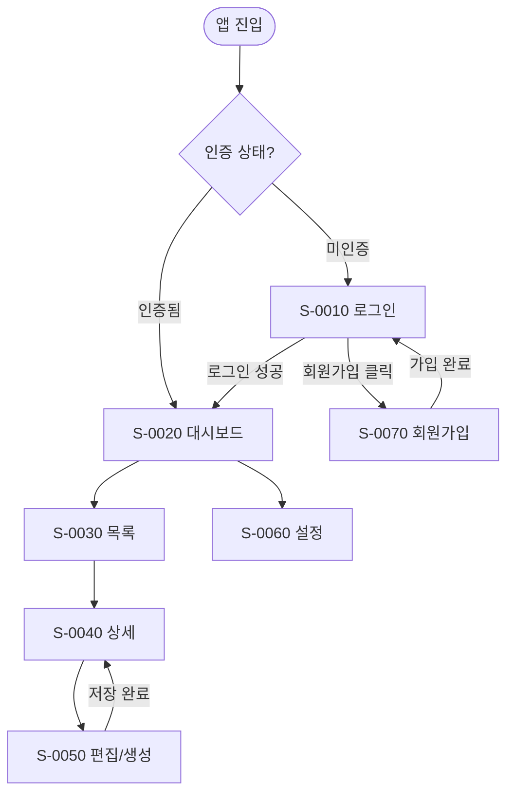
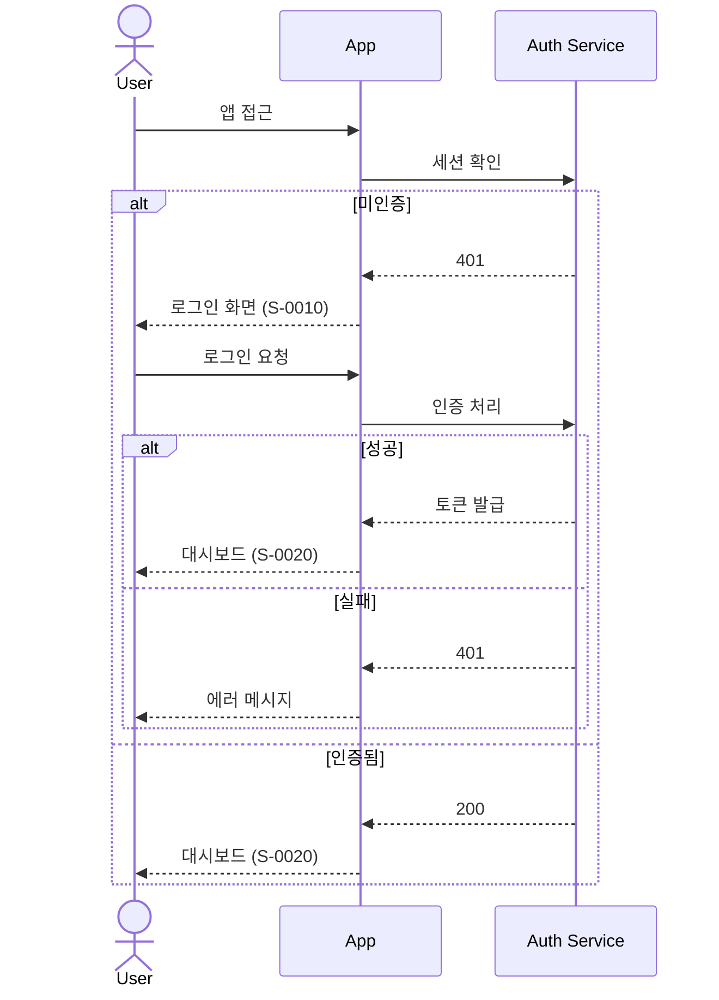

# {{PROJECT_NAME}} Screen Flow

## 1. Overview

### 1.1 Purpose

화면 간의 전환 흐름(Navigation Flow)을 정의한다.
사용자가 각 화면에서 다른 화면으로 이동하는 경로, 조건, 트리거를 시각화한다.

### 1.2 Flow Legend

| Symbol | Meaning |
|--------|---------|
| `-->` | 무조건 전환 (클릭, 탭) |
| `-.->` | 조건부 전환 |
| `==>` | 리다이렉트 (자동 전환) |
| `x--x` | 접근 불가 (권한 부족) |

---

## 2. Global Navigation Flow

전체 화면 간 네비게이션 흐름을 한 눈에 보여주는 다이어그램.

---

## 3. Flow Details

### 3.1 Authentication Flow

| From | To | Trigger | Condition | Notes |
|------|----|---------|-----------|-------|
| 앱 진입 | S-0010 로그인 | 자동 리다이렉트 | 미인증 | 세션 없거나 토큰 만료 |
| 앱 진입 | S-0020 대시보드 | 자동 리다이렉트 | 인증됨 | 유효한 세션 존재 |
| S-0010 | S-0020 | 로그인 버튼 클릭 | 인증 성공 | 토큰 저장 후 이동 |
| S-0010 | S-0010 | 로그인 버튼 클릭 | 인증 실패 | 에러 메시지 표시 |
| S-0010 | S-0070 | 회원가입 링크 클릭 | — | — |
| S-0070 | S-0010 | 가입 완료 | — | 성공 토스트 표시 |
| 모든 화면 | S-0010 | 로그아웃 | — | 세션 삭제 후 리다이렉트 |

### 3.2 Main Navigation Flow

| From | To | Trigger | Condition | Notes |
|------|----|---------|-----------|-------|
| S-0020 | S-0030 | 메뉴 클릭 | — | — |
| S-0030 | S-0040 | 항목 클릭 | — | — |
| S-0040 | S-0050 | 편집 버튼 클릭 | 권한 있음 | 편집 권한 필요 |
| S-0050 | S-0040 | 저장 완료 | — | 성공 토스트 표시 |
| S-0050 | S-0050 | 저장 실패 | — | 에러 메시지 표시 |
| S-0030 | S-0050 | 생성 버튼 클릭 | 권한 있음 | 빈 폼 표시 |
| S-0050 | S-0030 | 생성 완료 | — | 목록으로 이동 |

### 3.3 {{Flow Name}}

| From | To | Trigger | Condition | Notes |
|------|----|---------|-----------|-------|
| {{S-NNNN}} | {{S-NNNN}} | {{트리거}} | {{조건}} | {{비고}} |

---

## 4. Error & Edge Case Flows

| Scenario | Current Screen | Behavior | Target Screen |
|----------|---------------|----------|---------------|
| 세션 만료 | 모든 화면 | 자동 로그아웃 | S-0010 |
| 404 Not Found | — | 에러 페이지 표시 | 404 페이지 |
| 500 Server Error | 모든 화면 | 에러 토스트 | 현재 화면 유지 |
| 네트워크 오류 | 모든 화면 | 오프라인 배너 | 현재 화면 유지 |
| 권한 부족 | 보호된 화면 | 403 에러 | 이전 화면 또는 대시보드 |

---

## 5. Deep Link Map

| Path Pattern | Screen | Parameters | Auth Required |
|--------------|--------|------------|---------------|
| `/` | S-0020 대시보드 | — | Y |
| `/login` | S-0010 로그인 | `?redirect=` | N |
| `/signup` | S-0070 회원가입 | — | N |
| `/{{resource}}` | S-0030 목록 | `?page=&sort=` | Y |
| `/{{resource}}/:id` | S-0040 상세 | `:id` | Y |
| `/{{resource}}/:id/edit` | S-0050 편집 | `:id` | Y |
| `/{{resource}}/new` | S-0050 생성 | — | Y |
| `/settings` | S-0060 설정 | — | Y |

---

## Change Log

| Version | Date | Author | Description |
|---------|------|--------|-------------|
| v0.1.0 | {{DATE}} | u-UX | Initial draft |
