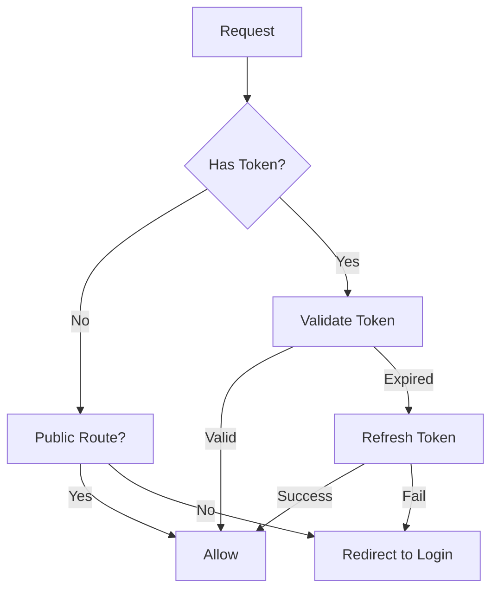

# {{PROJECT_NAME}} Code Record

## 1. Background

### 1.1 Purpose

{{코드 기록 문서의 목적. 구현된 코드의 파일 매핑, 빌드 설정, API 구현 상태를 기록한다.}}

---

## 2. Build Configuration

### 2.1 Project Structure

```
{{PROJECT_NAME}}/
├── apps/
│   └── web/
│       ├── app/
│       │   ├── layout.tsx
│       │   ├── page.tsx
│       │   ├── auth/
│       │   │   ├── login/page.tsx
│       │   │   └── register/page.tsx
│       │   └── dashboard/
│       │       └── page.tsx
│       ├── public/
│       └── package.json
├── packages/
│   ├── ui/
│   │   ├── src/
│   │   │   └── components/
│   │   └── package.json
│   ├── data/
│   │   ├── src/
│   │   │   └── hooks/
│   │   └── package.json
│   ├── domain/
│   │   ├── src/
│   │   │   └── types/
│   │   └── package.json
│   ├── infrastructure/
│   │   └── package.json
│   ├── tokens/
│   │   ├── src/
│   │   │   └── tokens.css
│   │   └── package.json
│   └── config/
│       └── package.json
├── turbo.json
├── package.json
└── bun.lockb
```

### 2.2 Tech Stack

| Category | Technology | Version |
|----------|-----------|---------|
| Runtime | bun | latest |
| Framework | Next.js (App Router) | 14.x |
| Monorepo | Turborepo | latest |
| State | react-query | 5.x |
| Styling | CSS (Design Token) | - |
| UI Docs | Storybook | 8.x |
| ORM | Prisma / Drizzle | latest |
| Language | TypeScript | 5.x |

### 2.3 Build Commands

| Command | Description | Status |
|---------|-------------|--------|
| `bun install` | 의존성 설치 | - |
| `bun run build` | 전체 빌드 | - |
| `bun run dev` | 개발 서버 | - |
| `bun run lint` | 린트 검사 | - |
| `bun run test` | 테스트 실행 | - |
| `bun run storybook` | Storybook 실행 | - |

---

## 3. File Mapping

### 3.1 Entity → Code Model Mapping

| Entity (ERD) | Model File | Status |
|-------------|-----------|--------|
| USER | `packages/domain/src/types/user.ts` | - |
| {{ENTITY}} | `packages/domain/src/types/{{entity}}.ts` | - |

### 3.2 API Endpoint → Route Mapping

| Endpoint (API Contract) | Route File | Status |
|------------------------|-----------|--------|
| POST /auth/login | `apps/web/app/api/auth/login/route.ts` | - |
| POST /auth/register | `apps/web/app/api/auth/register/route.ts` | - |
| GET /{{resource}} | `apps/web/app/api/{{resource}}/route.ts` | - |
| POST /{{resource}} | `apps/web/app/api/{{resource}}/route.ts` | - |

### 3.3 Screen → Page/Component Mapping

| Screen (Design) | Page File | Components | Status |
|----------------|----------|-----------|--------|
| S-001 Home | `apps/web/app/page.tsx` | Header, HeroSection, FeatureCard | - |
| S-002 Dashboard | `apps/web/app/dashboard/page.tsx` | Sidebar, SummaryCard, DataTable | - |
| S-006 Login | `apps/web/app/auth/login/page.tsx` | LoginForm, EmailInput, PasswordInput | - |

### 3.4 Component → Storybook Mapping

| Component | Source File | Story File | Status |
|-----------|-----------|-----------|--------|
| Button | `packages/ui/src/components/Button.tsx` | `Button.stories.tsx` | - |
| {{Component}} | `packages/ui/src/components/{{Component}}.tsx` | `{{Component}}.stories.tsx` | - |

---

## 4. Deploy Log

| # | Date | Type | Command | Result | Notes |
|---|------|------|---------|--------|-------|
| 1 | {{DATE}} | Build | `bun run build` | - | Initial build |

---

## 5. API Specification (Implemented)

| Method | Path | Implementation | Tests | Status |
|--------|------|---------------|-------|--------|
| POST | /auth/login | `apps/web/app/api/auth/login/route.ts` | - | - |
| POST | /auth/register | `apps/web/app/api/auth/register/route.ts` | - | - |
| GET | /{{resource}} | - | - | - |

---

## 6. Logic Flow

### 6.1 Authentication Flow



### 6.2 {{Feature}} Flow

```mermaid
flowchart TD
    A[{{Input}}] --> B[{{Step 1}}]
    B --> C{{{Condition}}}
    C -->|Yes| D[{{Step 2a}}]
    C -->|No| E[{{Step 2b}}]
    D --> F[{{Output}}]
    E --> F
```

---

## 7. FR Implementation Status

| FR-ID | Feature | Code Files | Build | Test | Status |
|-------|---------|-----------|-------|------|--------|
| FR-001 | {{기능명}} | - | - | - | Not Started |
| FR-002 | {{기능명}} | - | - | - | Not Started |

---

## Change Log

| Version | Date | Author | Description |
|---------|------|--------|-------------|
| v0.1.0 | {{DATE}} | u-DV | Initial draft |
