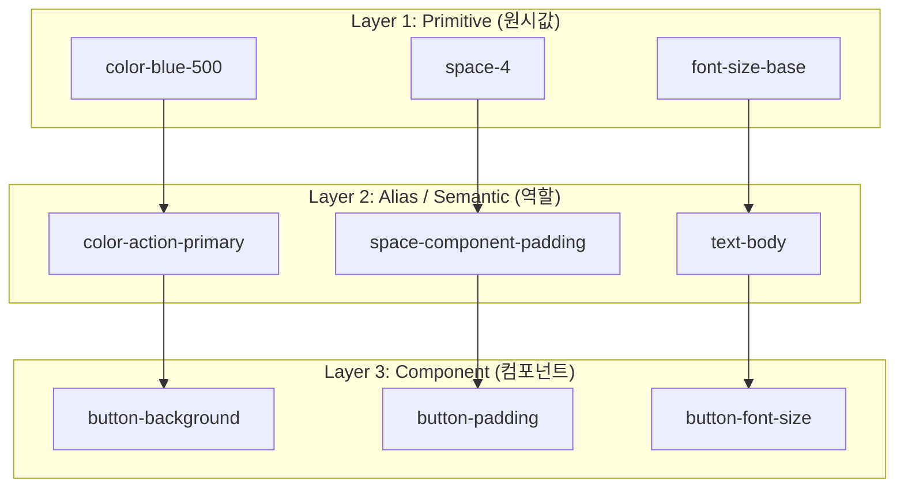
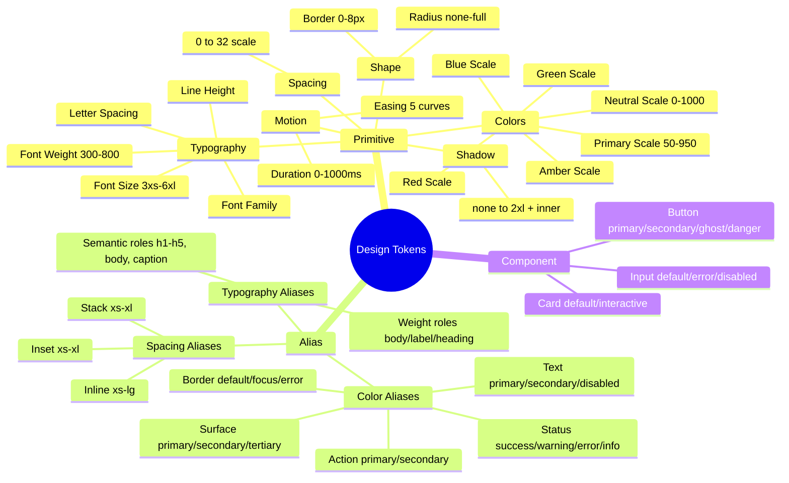

# {{PROJECT_NAME}} Design Tokens

## 1. Overview

### 1.1 Purpose

CSS Custom Properties로 구현되는 디자인 토큰을 3-Layer 계층 구조로 정의한다.
`packages/tokens/src/`에 위치하며 모든 앱과 컴포넌트에서 공유된다.

### 1.2 Token Hierarchy



### 1.3 Naming Convention

| Layer | Pattern | Example |
|-------|---------|---------|
| Primitive | `--{category}-{scale}` | `--color-blue-500`, `--space-4` |
| Alias | `--{role}-{variant}-{state?}` | `--color-action-primary`, `--color-action-primary-hover` |
| Component | `--{component}-{property}-{variant?}-{state?}` | `--button-bg-primary-hover` |

### 1.4 Token File Structure

```
packages/tokens/src/
├── primitive/
│   ├── colors.css          # 색상 원시 팔레트
│   ├── typography.css      # 타이포그래피 원시 스케일
│   ├── spacing.css         # 간격 원시 스케일
│   ├── shape.css           # 반경, 테두리 원시 스케일
│   ├── shadow.css          # 그림자 원시 스케일
│   └── motion.css          # 애니메이션 원시 스케일
├── alias/
│   ├── colors.css          # 의미론적 색상 토큰
│   ├── typography.css      # 의미론적 타이포 토큰
│   └── spacing.css         # 의미론적 간격 토큰
├── component/
│   ├── button.css          # 버튼 컴포넌트 토큰
│   ├── input.css           # 입력 컴포넌트 토큰
│   ├── card.css            # 카드 컴포넌트 토큰
│   └── {component}.css     # 컴포넌트별 토큰
├── themes/
│   ├── light.css           # 라이트 테마 오버라이드
│   └── dark.css            # 다크 테마 오버라이드
└── index.css               # 전체 import
```

### 1.5 Implementation Status Legend

| Symbol | Status | Description |
|--------|--------|-------------|
| ✅ | Done | 정의 및 코드 적용 완료 |
| ⏳ | In Progress | 정의 완료, 코드 적용 중 |
| ❌ | Not Started | 미정의 |

### 1.6 Token Implementation Summary

| Category | Total | Done | In Progress | Not Started | Progress |
|----------|-------|------|-------------|-------------|----------|
| Primitive — Colors | {{N}} | {{N}} | {{N}} | {{N}} | {{N}}% |
| Primitive — Typography | {{N}} | {{N}} | {{N}} | {{N}} | {{N}}% |
| Primitive — Spacing | {{N}} | {{N}} | {{N}} | {{N}} | {{N}}% |
| Primitive — Shape | {{N}} | {{N}} | {{N}} | {{N}} | {{N}}% |
| Primitive — Shadow | {{N}} | {{N}} | {{N}} | {{N}} | {{N}}% |
| Primitive — Motion | {{N}} | {{N}} | {{N}} | {{N}} | {{N}}% |
| Alias — Colors | {{N}} | {{N}} | {{N}} | {{N}} | {{N}}% |
| Alias — Typography | {{N}} | {{N}} | {{N}} | {{N}} | {{N}}% |
| Alias — Spacing | {{N}} | {{N}} | {{N}} | {{N}} | {{N}}% |
| Component Tokens | {{N}} | {{N}} | {{N}} | {{N}} | {{N}}% |
| **합계** | **{{TOTAL}}** | **{{DONE}}** | **{{WIP}}** | **{{TODO}}** | **{{PERCENT}}%** |

---

## 2. Primitive Tokens

실제 값(Raw Values)을 정의한다. 컴포넌트에서 직접 사용하지 않는다.

### 2.1 Color Primitives

#### 2.1.1 Primary Scale

```css
/* primitive/colors.css */
:root {
  --color-primary-50:  {{VALUE}};
  --color-primary-100: {{VALUE}};
  --color-primary-200: {{VALUE}};
  --color-primary-300: {{VALUE}};
  --color-primary-400: {{VALUE}};
  --color-primary-500: {{VALUE}};
  --color-primary-600: {{VALUE}};
  --color-primary-700: {{VALUE}};
  --color-primary-800: {{VALUE}};
  --color-primary-900: {{VALUE}};
  --color-primary-950: {{VALUE}};
}
```

| Token | Value | Contrast (White) | Contrast (Black) | Status |
|-------|-------|-----------------|-----------------|--------|
| `--color-primary-50` | `{{VALUE}}` | — | ≥ 4.5:1 | ❌ |
| `--color-primary-100` | `{{VALUE}}` | — | ≥ 4.5:1 | ❌ |
| `--color-primary-200` | `{{VALUE}}` | — | ≥ 4.5:1 | ❌ |
| `--color-primary-300` | `{{VALUE}}` | — | ≥ 3:1 | ❌ |
| `--color-primary-400` | `{{VALUE}}` | < 4.5:1 | — | ❌ |
| `--color-primary-500` | `{{VALUE}}` | ≥ 4.5:1 (AA) | — | ❌ |
| `--color-primary-600` | `{{VALUE}}` | ≥ 4.5:1 (AA) | — | ❌ |
| `--color-primary-700` | `{{VALUE}}` | ≥ 7:1 (AAA) | — | ❌ |
| `--color-primary-800` | `{{VALUE}}` | ≥ 7:1 (AAA) | — | ❌ |
| `--color-primary-900` | `{{VALUE}}` | ≥ 12:1 | — | ❌ |
| `--color-primary-950` | `{{VALUE}}` | ≥ 15:1 | — | ❌ |

#### 2.1.2 Neutral Scale

```css
:root {
  --color-neutral-0:   #FFFFFF;
  --color-neutral-50:  {{VALUE}};
  --color-neutral-100: {{VALUE}};
  --color-neutral-200: {{VALUE}};
  --color-neutral-300: {{VALUE}};
  --color-neutral-400: {{VALUE}};
  --color-neutral-500: {{VALUE}};
  --color-neutral-600: {{VALUE}};
  --color-neutral-700: {{VALUE}};
  --color-neutral-800: {{VALUE}};
  --color-neutral-900: {{VALUE}};
  --color-neutral-950: {{VALUE}};
  --color-neutral-1000: #000000;
}
```

#### 2.1.3 Status Scales

```css
:root {
  /* Success (Green) */
  --color-green-100: {{VALUE}};
  --color-green-500: {{VALUE}};
  --color-green-600: {{VALUE}};
  --color-green-700: {{VALUE}};

  /* Warning (Amber) */
  --color-amber-100: {{VALUE}};
  --color-amber-400: {{VALUE}};
  --color-amber-500: {{VALUE}};
  --color-amber-700: {{VALUE}};

  /* Error (Red) */
  --color-red-100: {{VALUE}};
  --color-red-500: {{VALUE}};
  --color-red-600: {{VALUE}};
  --color-red-700: {{VALUE}};

  /* Info (Blue) */
  --color-blue-100: {{VALUE}};
  --color-blue-500: {{VALUE}};
  --color-blue-600: {{VALUE}};
  --color-blue-700: {{VALUE}};
}
```

### 2.2 Typography Primitives

```css
/* primitive/typography.css */
:root {
  /* Font Family */
  --font-sans:    "{{Font}}", system-ui, -apple-system, sans-serif;
  --font-display: "{{Font}}", var(--font-sans);
  --font-mono:    "{{Font}}", "Fira Code", "Consolas", monospace;

  /* Font Size — Minor Third Scale (1.25x) */
  --font-size-3xs: 0.512rem;    /* ~8px */
  --font-size-2xs: 0.64rem;     /* ~10px */
  --font-size-xs:  0.75rem;     /* 12px */
  --font-size-sm:  0.875rem;    /* 14px */
  --font-size-base: 1rem;       /* 16px */
  --font-size-lg:  1.125rem;    /* 18px */
  --font-size-xl:  1.25rem;     /* 20px */
  --font-size-2xl: 1.5rem;      /* 24px */
  --font-size-3xl: 1.875rem;    /* 30px */
  --font-size-4xl: 2.25rem;     /* 36px */
  --font-size-5xl: 3rem;        /* 48px */
  --font-size-6xl: 3.75rem;     /* 60px */

  /* Font Weight */
  --font-weight-light:     300;
  --font-weight-normal:    400;
  --font-weight-medium:    500;
  --font-weight-semibold:  600;
  --font-weight-bold:      700;
  --font-weight-extrabold: 800;

  /* Line Height */
  --line-height-none:    1;
  --line-height-tight:   1.2;
  --line-height-snug:    1.35;
  --line-height-normal:  1.5;
  --line-height-relaxed: 1.625;
  --line-height-loose:   2;

  /* Letter Spacing */
  --letter-spacing-tighter: -0.05em;
  --letter-spacing-tight:   -0.025em;
  --letter-spacing-normal:  0em;
  --letter-spacing-wide:    0.025em;
  --letter-spacing-wider:   0.05em;
  --letter-spacing-widest:  0.1em;
}
```

### 2.3 Spacing Primitives

```css
/* primitive/spacing.css */
:root {
  --space-px:   1px;
  --space-0:    0;
  --space-0-5:  0.125rem;  /* 2px  */
  --space-1:    0.25rem;   /* 4px  */
  --space-1-5:  0.375rem;  /* 6px  */
  --space-2:    0.5rem;    /* 8px  */
  --space-2-5:  0.625rem;  /* 10px */
  --space-3:    0.75rem;   /* 12px */
  --space-3-5:  0.875rem;  /* 14px */
  --space-4:    1rem;      /* 16px */
  --space-5:    1.25rem;   /* 20px */
  --space-6:    1.5rem;    /* 24px */
  --space-7:    1.75rem;   /* 28px */
  --space-8:    2rem;      /* 32px */
  --space-9:    2.25rem;   /* 36px */
  --space-10:   2.5rem;    /* 40px */
  --space-11:   2.75rem;   /* 44px */
  --space-12:   3rem;      /* 48px */
  --space-14:   3.5rem;    /* 56px */
  --space-16:   4rem;      /* 64px */
  --space-20:   5rem;      /* 80px */
  --space-24:   6rem;      /* 96px */
  --space-28:   7rem;      /* 112px */
  --space-32:   8rem;      /* 128px */
}
```

### 2.4 Shape Primitives

```css
/* primitive/shape.css */
:root {
  /* Border Radius */
  --radiu-skill-none: 0;
  --radiu-skill-xs:   2px;
  --radiu-skill-sm:   4px;
  --radiu-skill-md:   6px;
  --radiu-skill-lg:   8px;
  --radiu-skill-xl:   12px;
  --radiu-skill-2xl:  16px;
  --radiu-skill-3xl:  24px;
  --radiu-skill-full: 9999px;

  /* Border Width */
  --border-0: 0;
  --border-1: 1px;
  --border-2: 2px;
  --border-4: 4px;
  --border-8: 8px;
}
```

### 2.5 Shadow Primitives

```css
/* primitive/shadow.css */
:root {
  --shadow-none: none;
  --shadow-xs:   0 1px 2px 0 rgba(0, 0, 0, 0.05);
  --shadow-sm:   0 1px 3px 0 rgba(0, 0, 0, 0.10), 0 1px 2px -1px rgba(0, 0, 0, 0.10);
  --shadow-md:   0 4px 6px -1px rgba(0, 0, 0, 0.10), 0 2px 4px -2px rgba(0, 0, 0, 0.10);
  --shadow-lg:   0 10px 15px -3px rgba(0, 0, 0, 0.10), 0 4px 6px -4px rgba(0, 0, 0, 0.10);
  --shadow-xl:   0 20px 25px -5px rgba(0, 0, 0, 0.10), 0 8px 10px -6px rgba(0, 0, 0, 0.10);
  --shadow-2xl:  0 25px 50px -12px rgba(0, 0, 0, 0.25);
  --shadow-inner: inset 0 2px 4px 0 rgba(0, 0, 0, 0.05);
}
```

### 2.6 Motion Primitives

```css
/* primitive/motion.css */
:root {
  /* Duration */
  --duration-instant: 0ms;
  --duration-75:      75ms;
  --duration-100:     100ms;
  --duration-150:     150ms;
  --duration-200:     200ms;
  --duration-300:     300ms;
  --duration-500:     500ms;
  --duration-700:     700ms;
  --duration-1000:    1000ms;

  /* Easing */
  --ease-linear:  linear;
  --ease-in:      cubic-bezier(0.4, 0, 1, 1);
  --ease-out:     cubic-bezier(0, 0, 0.2, 1);
  --ease-in-out:  cubic-bezier(0.4, 0, 0.2, 1);
  --ease-spring:  cubic-bezier(0.175, 0.885, 0.32, 1.275);
  --ease-bounce:  cubic-bezier(0.34, 1.56, 0.64, 1);
}
```

---

## 3. Alias / Semantic Tokens

Primitive 토큰에 의미론적 역할을 부여한다. 테마 전환 시 이 레이어만 오버라이드한다.

### 3.1 Color Aliases

```css
/* alias/colors.css */
:root {
  /* Action */
  --color-action-primary:         var(--color-primary-600);
  --color-action-primary-hover:   var(--color-primary-700);
  --color-action-primary-active:  var(--color-primary-800);
  --color-action-primary-subtle:  var(--color-primary-50);
  --color-action-secondary:       var(--color-secondary-500);
  --color-action-secondary-hover: var(--color-secondary-600);

  /* Status */
  --color-statu-skill-success:         var(--color-green-600);
  --color-statu-skill-success-subtle:  var(--color-green-100);
  --color-statu-skill-warning:         var(--color-amber-500);
  --color-statu-skill-warning-subtle:  var(--color-amber-100);
  --color-statu-skill-error:           var(--color-red-600);
  --color-statu-skill-error-subtle:    var(--color-red-100);
  --color-statu-skill-info:            var(--color-blue-600);
  --color-statu-skill-info-subtle:     var(--color-blue-100);

  /* Surface */
  --color-surface-primary:        var(--color-neutral-0);
  --color-surface-secondary:      var(--color-neutral-50);
  --color-surface-tertiary:       var(--color-neutral-100);
  --color-surface-inverse:        var(--color-neutral-900);
  --color-surface-overlay:        rgba(0, 0, 0, 0.4);

  /* Text */
  --color-text-primary:           var(--color-neutral-900);
  --color-text-secondary:         var(--color-neutral-600);
  --color-text-tertiary:          var(--color-neutral-400);
  --color-text-disabled:          var(--color-neutral-400);
  --color-text-inverse:           var(--color-neutral-0);
  --color-text-on-primary:        var(--color-neutral-0);
  --color-text-link:              var(--color-primary-600);
  --color-text-link-hover:        var(--color-primary-700);

  /* Border */
  --color-border-default:         var(--color-neutral-200);
  --color-border-strong:          var(--color-neutral-400);
  --color-border-focus:           var(--color-primary-500);
  --color-border-error:           var(--color-red-500);
  --color-border-success:         var(--color-green-500);
  --color-border-inverse:         var(--color-neutral-700);
}
```

### 3.2 Alias Status Table

| Alias Token | Light Value | Dark Value | Usage | Status |
|-------------|-------------|------------|-------|--------|
| `--color-action-primary` | `primary-600` | `primary-400` | 주요 버튼, 링크 | ❌ |
| `--color-action-primary-hover` | `primary-700` | `primary-300` | 호버 상태 | ❌ |
| `--color-action-primary-active` | `primary-800` | `primary-200` | 클릭 상태 | ❌ |
| `--color-action-primary-subtle` | `primary-50` | `primary-950` | 배경 강조 | ❌ |
| `--color-statu-skill-success` | `green-600` | `green-400` | 성공 메시지 | ❌ |
| `--color-statu-skill-success-subtle` | `green-100` | `green-950` | 성공 배경 | ❌ |
| `--color-statu-skill-error` | `red-600` | `red-400` | 에러 메시지 | ❌ |
| `--color-statu-skill-error-subtle` | `red-100` | `red-950` | 에러 배경 | ❌ |
| `--color-surface-primary` | `neutral-0` | `neutral-950` | 메인 배경 | ❌ |
| `--color-surface-secondary` | `neutral-50` | `neutral-900` | 카드 배경 | ❌ |
| `--color-text-primary` | `neutral-900` | `neutral-50` | 본문 텍스트 | ❌ |
| `--color-text-secondary` | `neutral-600` | `neutral-400` | 보조 텍스트 | ❌ |
| `--color-border-default` | `neutral-200` | `neutral-700` | 기본 테두리 | ❌ |
| `--color-border-focus` | `primary-500` | `primary-400` | 포커스 링 | ❌ |

### 3.3 Typography Aliases

```css
/* alias/typography.css */
:root {
  /* Semantic Type Roles */
  --text-display:    var(--font-size-4xl);
  --text-h1:         var(--font-size-4xl);
  --text-h2:         var(--font-size-3xl);
  --text-h3:         var(--font-size-2xl);
  --text-h4:         var(--font-size-xl);
  --text-h5:         var(--font-size-lg);
  --text-body-lg:    var(--font-size-lg);
  --text-body:       var(--font-size-base);
  --text-body-sm:    var(--font-size-sm);
  --text-label:      var(--font-size-sm);
  --text-caption:    var(--font-size-xs);
  --text-overline:   var(--font-size-xs);
  --text-code:       var(--font-size-sm);

  /* Semantic Weight Roles */
  --weight-body:     var(--font-weight-normal);
  --weight-label:    var(--font-weight-medium);
  --weight-heading:  var(--font-weight-semibold);
  --weight-display:  var(--font-weight-bold);

  /* Semantic Line Height Roles */
  --leading-heading: var(--line-height-tight);
  --leading-body:    var(--line-height-normal);
  --leading-code:    var(--line-height-relaxed);
}
```

### 3.4 Spacing Aliases

```css
/* alias/spacing.css */
:root {
  /* Inset (padding) */
  --space-inset-xs:  var(--space-2);   /* 8px  */
  --space-inset-sm:  var(--space-3);   /* 12px */
  --space-inset-md:  var(--space-4);   /* 16px */
  --space-inset-lg:  var(--space-6);   /* 24px */
  --space-inset-xl:  var(--space-8);   /* 32px */

  /* Stack (vertical gap) */
  --space-stack-xs:  var(--space-1);   /* 4px  */
  --space-stack-sm:  var(--space-2);   /* 8px  */
  --space-stack-md:  var(--space-4);   /* 16px */
  --space-stack-lg:  var(--space-6);   /* 24px */
  --space-stack-xl:  var(--space-8);   /* 32px */

  /* Inline (horizontal gap) */
  --space-inline-xs: var(--space-1);   /* 4px  */
  --space-inline-sm: var(--space-2);   /* 8px  */
  --space-inline-md: var(--space-4);   /* 16px */
  --space-inline-lg: var(--space-6);   /* 24px */

  /* Layout */
  --space-section:   var(--space-12);  /* 48px */
  --space-page-x:    var(--space-4);   /* Mobile page horizontal padding */
  --space-page-y:    var(--space-8);   /* Page vertical padding */
}
```

---

## 4. Component Tokens

컴포넌트별 세부 제어를 위한 토큰. Alias 토큰을 참조한다.

### 4.1 Button Tokens

```css
/* component/button.css */
:root {
  /* Primary Button */
  --button-primary-bg:             var(--color-action-primary);
  --button-primary-bg-hover:       var(--color-action-primary-hover);
  --button-primary-bg-active:      var(--color-action-primary-active);
  --button-primary-color:          var(--color-text-on-primary);
  --button-primary-border:         transparent;

  /* Secondary Button */
  --button-secondary-bg:           var(--color-surface-secondary);
  --button-secondary-bg-hover:     var(--color-surface-tertiary);
  --button-secondary-color:        var(--color-text-primary);
  --button-secondary-border:       var(--color-border-default);

  /* Danger Button */
  --button-danger-bg:              var(--color-statu-skill-error);
  --button-danger-bg-hover:        var(--color-red-700);
  --button-danger-color:           var(--color-neutral-0);

  /* Ghost Button */
  --button-ghost-bg:               transparent;
  --button-ghost-bg-hover:         var(--color-action-primary-subtle);
  --button-ghost-color:            var(--color-action-primary);

  /* Disabled (All) */
  --button-disabled-opacity:       0.4;
  --button-disabled-cursor:        not-allowed;

  /* Size — SM */
  --button-sm-height:              var(--space-8);    /* 32px */
  --button-sm-padding-x:           var(--space-3);    /* 12px */
  --button-sm-font-size:           var(--text-body-sm);
  --button-sm-radius:              var(--radiu-skill-sm);

  /* Size — MD (default) */
  --button-md-height:              var(--space-10);   /* 40px */
  --button-md-padding-x:           var(--space-4);    /* 16px */
  --button-md-font-size:           var(--text-body);
  --button-md-radius:              var(--radiu-skill-md);

  /* Size — LG */
  --button-lg-height:              var(--space-12);   /* 48px */
  --button-lg-padding-x:           var(--space-6);    /* 24px */
  --button-lg-font-size:           var(--text-body-lg);
  --button-lg-radius:              var(--radiu-skill-md);

  /* Focus */
  --button-focu-skill-ring:             var(--color-border-focus);
  --button-focu-skill-ring-offset:      2px;
  --button-focu-skill-ring-width:       2px;
}
```

### 4.2 Input Tokens

```css
/* component/input.css */
:root {
  --input-bg:              var(--color-surface-primary);
  --input-bg-disabled:     var(--color-surface-tertiary);
  --input-color:           var(--color-text-primary);
  --input-placeholder:     var(--color-text-tertiary);
  --input-border:          var(--color-border-default);
  --input-border-focus:    var(--color-border-focus);
  --input-border-error:    var(--color-border-error);
  --input-border-success:  var(--color-border-success);
  --input-border-radius:   var(--radiu-skill-md);
  --input-border-width:    var(--border-1);

  /* Size */
  --input-sm-height:       var(--space-8);
  --input-md-height:       var(--space-10);
  --input-lg-height:       var(--space-12);
  --input-padding-x:       var(--space-3);
  --input-font-size:       var(--text-body);
  --input-label-size:      var(--text-label);
  --input-helper-size:     var(--text-caption);
}
```

### 4.3 Card Tokens

```css
/* component/card.css */
:root {
  --card-bg:               var(--color-surface-secondary);
  --card-bg-hover:         var(--color-surface-tertiary);
  --card-border:           var(--color-border-default);
  --card-border-radius:    var(--radiu-skill-lg);
  --card-shadow:           var(--shadow-sm);
  --card-shadow-hover:     var(--shadow-md);
  --card-padding:          var(--space-inset-md);
  --card-gap:              var(--space-stack-md);
}
```

### 4.4 Component Token Status

| Component | Tokens Defined | Implemented | Status |
|-----------|---------------|-------------|--------|
| Button | 20 | {{N}} | ❌ |
| Input | 14 | {{N}} | ❌ |
| Card | 8 | {{N}} | ❌ |
| Modal | {{N}} | {{N}} | ❌ |
| Badge | {{N}} | {{N}} | ❌ |
| {{Component}} | {{N}} | {{N}} | ❌ |

---

## 5. Theme Tokens

### 5.1 Light Theme (Default)

```css
/* themes/light.css */
[data-theme="light"], :root {
  color-scheme: light;

  --color-surface-primary:   var(--color-neutral-0);
  --color-surface-secondary: var(--color-neutral-50);
  --color-surface-tertiary:  var(--color-neutral-100);
  --color-text-primary:      var(--color-neutral-900);
  --color-text-secondary:    var(--color-neutral-600);
  --color-text-disabled:     var(--color-neutral-400);
  --color-border-default:    var(--color-neutral-200);
  --color-action-primary:    var(--color-primary-600);
}
```

### 5.2 Dark Theme

```css
/* themes/dark.css */
[data-theme="dark"] {
  color-scheme: dark;

  --color-surface-primary:   var(--color-neutral-950);
  --color-surface-secondary: var(--color-neutral-900);
  --color-surface-tertiary:  var(--color-neutral-800);
  --color-text-primary:      var(--color-neutral-50);
  --color-text-secondary:    var(--color-neutral-400);
  --color-text-disabled:     var(--color-neutral-600);
  --color-border-default:    var(--color-neutral-700);
  --color-action-primary:    var(--color-primary-400);
}

/* 시스템 다크모드 자동 감지 */
@media (prefers-color-scheme: dark) {
  :root:not([data-theme="light"]) {
    /* dark theme tokens */
  }
}
```

### 5.3 Theme Token Mapping

| Alias Token | Light | Dark | ΔE (변화량) |
|-------------|-------|------|-----------|
| `--color-surface-primary` | `neutral-0 (#FFF)` | `neutral-950 (#{{HEX}})` | 명도 -95% |
| `--color-text-primary` | `neutral-900 (#{{HEX}})` | `neutral-50 (#{{HEX}})` | 명도 +85% |
| `--color-action-primary` | `primary-600 (#{{HEX}})` | `primary-400 (#{{HEX}})` | 명도 +20% |
| `--color-border-default` | `neutral-200 (#{{HEX}})` | `neutral-700 (#{{HEX}})` | 명도 -50% |

---

## 6. Token Export Formats

### 6.1 CSS Custom Properties (Primary)

```css
/* packages/tokens/src/index.css */
@import './primitive/colors.css';
@import './primitive/typography.css';
@import './primitive/spacing.css';
@import './primitive/shape.css';
@import './primitive/shadow.css';
@import './primitive/motion.css';
@import './alias/colors.css';
@import './alias/typography.css';
@import './alias/spacing.css';
@import './component/button.css';
@import './component/input.css';
@import './component/card.css';
@import './themes/light.css';
@import './themes/dark.css';
```

### 6.2 JavaScript / TypeScript Export

```typescript
// packages/tokens/src/tokens.ts
export const tokens = {
  color: {
    primary: {
      50:  'var(--color-primary-50)',
      500: 'var(--color-primary-500)',
      600: 'var(--color-primary-600)',
    },
    action: {
      primary: 'var(--color-action-primary)',
    },
  },
  space: {
    1: 'var(--space-1)',
    4: 'var(--space-4)',
  },
} as const;
```

### 6.3 DTCG JSON Format (Design Token Community Group)

```json
{
  "color": {
    "primary": {
      "500": {
        "$value": "{{VALUE}}",
        "$type": "color",
        "$description": "Primary brand color — main usage"
      }
    },
    "action": {
      "primary": {
        "$value": "{color.primary.600}",
        "$type": "color",
        "$description": "Action primary alias"
      }
    }
  }
}
```

---

## 7. Token Hierarchy Mindmap



---

## Change Log

| Version | Date | Author | Description |
|---------|------|--------|-------------|
| v0.1.0 | {{DATE}} | u-UX | Initial draft — 3-layer token hierarchy |
