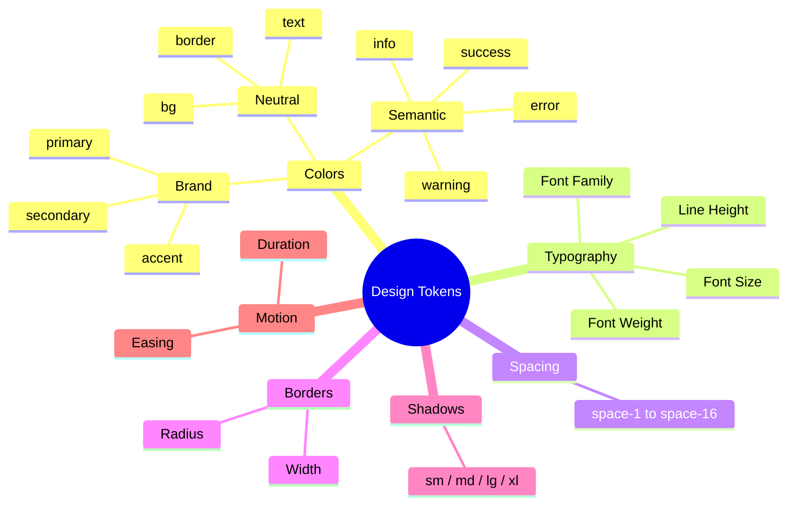

# {{PROJECT_NAME}} Design Tokens

## 1. Overview

### 1.1 Purpose

{{디자인 토큰 문서의 목적. packages/tokens에 정의할 CSS Custom Properties를 명세한다.}}

### 1.2 Token Path

```
packages/tokens/src/
├── colors.css          # 색상 토큰
├── typography.css      # 타이포그래피 토큰
├── spacing.css         # 간격 토큰
├── borders.css         # 테두리 토큰
├── shadows.css         # 그림자 토큰
├── motion.css          # 애니메이션 토큰
└── index.css           # 전체 import
```

### 1.3 Implementation Status Legend

| Symbol | Status | Description |
|--------|--------|-------------|
| ✅ | Done | 토큰 정의 및 코드 적용 완료 |
| ⏳ | In Progress | 정의 완료, 코드 적용 중 |
| ❌ | Not Started | 미정의 |

---

## 1.4 Token Implementation Summary

| Category | Total Tokens | Implemented | Progress |
|----------|-------------|-------------|----------|
| Colors — Brand | {{N}} | {{N}} | {{N}}% |
| Colors — Semantic | {{N}} | {{N}} | {{N}}% |
| Colors — Neutral | {{N}} | {{N}} | {{N}}% |
| Typography | {{N}} | {{N}} | {{N}}% |
| Spacing | {{N}} | {{N}} | {{N}}% |
| Borders | {{N}} | {{N}} | {{N}}% |
| Shadows | {{N}} | {{N}} | {{N}}% |
| Motion | {{N}} | {{N}} | {{N}}% |
| **합계** | **{{TOTAL}}** | **{{IMPL}}** | **{{PERCENT}}%** |

---

## 2. Color Tokens

### 2.1 colors.css

```css
:root {
  /* Brand */
  --color-primary: {{VALUE}};
  --color-primary-hover: {{VALUE}};
  --color-primary-active: {{VALUE}};
  --color-secondary: {{VALUE}};
  --color-accent: {{VALUE}};

  /* Semantic */
  --color-success: {{VALUE}};
  --color-warning: {{VALUE}};
  --color-error: {{VALUE}};
  --color-info: {{VALUE}};

  /* Neutral */
  --color-bg-primary: {{VALUE}};
  --color-bg-secondary: {{VALUE}};
  --color-bg-tertiary: {{VALUE}};
  --color-text-primary: {{VALUE}};
  --color-text-secondary: {{VALUE}};
  --color-text-disabled: {{VALUE}};
  --color-border: {{VALUE}};
  --color-border-focus: {{VALUE}};
}
```

### 2.2 Color Token Status

| Token | CSS Variable | Value | Status | Used In |
|-------|-------------|-------|--------|---------|
| Primary | `--color-primary` | `{{VALUE}}` | ✅ Done | Button, Link |
| Primary Hover | `--color-primary-hover` | `{{VALUE}}` | ✅ Done | Button:hover |
| Primary Active | `--color-primary-active` | `{{VALUE}}` | ❌ Not Started | Button:active |
| Secondary | `--color-secondary` | `{{VALUE}}` | ❌ Not Started | |
| Accent | `--color-accent` | `{{VALUE}}` | ❌ Not Started | |
| Success | `--color-success` | `{{VALUE}}` | ✅ Done | Alert, Badge |
| Warning | `--color-warning` | `{{VALUE}}` | ✅ Done | Alert |
| Error | `--color-error` | `{{VALUE}}` | ✅ Done | Input error, Alert |
| Info | `--color-info` | `{{VALUE}}` | ❌ Not Started | |
| BG Primary | `--color-bg-primary` | `{{VALUE}}` | ✅ Done | 전체 배경 |
| BG Secondary | `--color-bg-secondary` | `{{VALUE}}` | ⏳ In Progress | Card, Panel |
| BG Tertiary | `--color-bg-tertiary` | `{{VALUE}}` | ❌ Not Started | |
| Text Primary | `--color-text-primary` | `{{VALUE}}` | ✅ Done | 본문 텍스트 |
| Text Secondary | `--color-text-secondary` | `{{VALUE}}` | ✅ Done | 보조 텍스트 |
| Text Disabled | `--color-text-disabled` | `{{VALUE}}` | ❌ Not Started | |
| Border | `--color-border` | `{{VALUE}}` | ✅ Done | Input, Card |
| Border Focus | `--color-border-focus` | `{{VALUE}}` | ✅ Done | Input:focus |

---

## 3. Typography Tokens

### 3.1 typography.css

```css
:root {
  /* Font Family */
  --font-sans: {{VALUE}};
  --font-mono: {{VALUE}};

  /* Font Size */
  --text-xs: 0.75rem;
  --text-sm: 0.875rem;
  --text-base: 1rem;
  --text-lg: 1.125rem;
  --text-xl: 1.25rem;
  --text-2xl: 1.5rem;
  --text-3xl: 1.875rem;
  --text-4xl: 2.25rem;

  /* Font Weight */
  --font-normal: 400;
  --font-medium: 500;
  --font-semibold: 600;
  --font-bold: 700;

  /* Line Height */
  --leading-tight: 1.2;
  --leading-normal: 1.5;
  --leading-relaxed: 1.75;
}
```

### 3.2 Typography Token Status

| Token | CSS Variable | Value | Status |
|-------|-------------|-------|--------|
| Font Sans | `--font-sans` | `{{VALUE}}` | ❌ Not Started |
| Font Mono | `--font-mono` | `{{VALUE}}` | ❌ Not Started |
| Text XS | `--text-xs` | `0.75rem` | ✅ Done |
| Text SM | `--text-sm` | `0.875rem` | ✅ Done |
| Text Base | `--text-base` | `1rem` | ✅ Done |
| Text LG | `--text-lg` | `1.125rem` | ✅ Done |
| Text XL | `--text-xl` | `1.25rem` | ✅ Done |
| Text 2XL | `--text-2xl` | `1.5rem` | ❌ Not Started |
| Text 3XL | `--text-3xl` | `1.875rem` | ❌ Not Started |
| Text 4XL | `--text-4xl` | `2.25rem` | ❌ Not Started |
| Font Normal | `--font-normal` | `400` | ✅ Done |
| Font Medium | `--font-medium` | `500` | ✅ Done |
| Font Semibold | `--font-semibold` | `600` | ✅ Done |
| Font Bold | `--font-bold` | `700` | ✅ Done |

---

## 4. Spacing Tokens

### 4.1 spacing.css

```css
:root {
  --space-px: 1px;
  --space-0: 0;
  --space-1: 0.25rem;   /* 4px */
  --space-2: 0.5rem;    /* 8px */
  --space-3: 0.75rem;   /* 12px */
  --space-4: 1rem;      /* 16px */
  --space-5: 1.25rem;   /* 20px */
  --space-6: 1.5rem;    /* 24px */
  --space-8: 2rem;      /* 32px */
  --space-10: 2.5rem;   /* 40px */
  --space-12: 3rem;     /* 48px */
  --space-16: 4rem;     /* 64px */
}
```

### 4.2 Spacing Token Status

| Token | CSS Variable | Value | Status |
|-------|-------------|-------|--------|
| Space 1 | `--space-1` | `0.25rem (4px)` | ✅ Done |
| Space 2 | `--space-2` | `0.5rem (8px)` | ✅ Done |
| Space 3 | `--space-3` | `0.75rem (12px)` | ✅ Done |
| Space 4 | `--space-4` | `1rem (16px)` | ✅ Done |
| Space 5 | `--space-5` | `1.25rem (20px)` | ✅ Done |
| Space 6 | `--space-6` | `1.5rem (24px)` | ✅ Done |
| Space 8 | `--space-8` | `2rem (32px)` | ✅ Done |
| Space 10 | `--space-10` | `2.5rem (40px)` | ❌ Not Started |
| Space 12 | `--space-12` | `3rem (48px)` | ❌ Not Started |
| Space 16 | `--space-16` | `4rem (64px)` | ❌ Not Started |

---

## 5. Border Tokens

### 5.1 borders.css

```css
:root {
  /* Border Radius */
  --radius-none: 0;
  --radius-sm: 0.25rem;
  --radius-md: 0.375rem;
  --radius-lg: 0.5rem;
  --radius-xl: 0.75rem;
  --radius-full: 9999px;

  /* Border Width */
  --border-0: 0;
  --border-1: 1px;
  --border-2: 2px;
}
```

---

## 6. Shadow Tokens

### 6.1 shadows.css

```css
:root {
  --shadow-sm: 0 1px 2px rgba(0, 0, 0, 0.05);
  --shadow-md: 0 4px 6px rgba(0, 0, 0, 0.07);
  --shadow-lg: 0 10px 15px rgba(0, 0, 0, 0.1);
  --shadow-xl: 0 20px 25px rgba(0, 0, 0, 0.15);
}
```

---

## 7. Motion Tokens

### 7.1 motion.css

```css
:root {
  --duration-fast: 150ms;
  --duration-normal: 250ms;
  --duration-slow: 400ms;
  --easing-default: ease-in-out;
  --easing-in: ease-in;
  --easing-out: ease-out;
}
```

---

## 8. Token Hierarchy



---

## 9. Theme Support

### 8.1 Dark Theme (Optional)

```css
[data-theme="dark"] {
  --color-bg-primary: {{VALUE}};
  --color-bg-secondary: {{VALUE}};
  --color-text-primary: {{VALUE}};
  --color-text-secondary: {{VALUE}};
  --color-border: {{VALUE}};
}
```

---

## Change Log

| Version | Date | Author | Description |
|---------|------|--------|-------------|
| v0.1.0 | {{DATE}} | u-UX | Initial draft |
