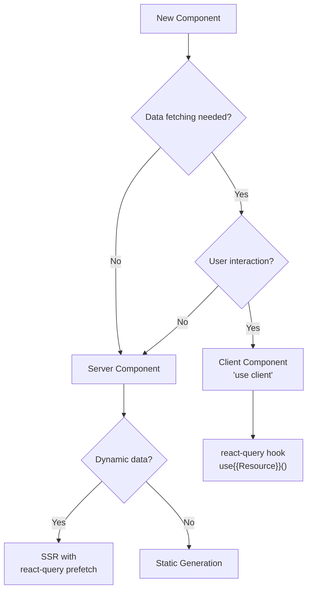
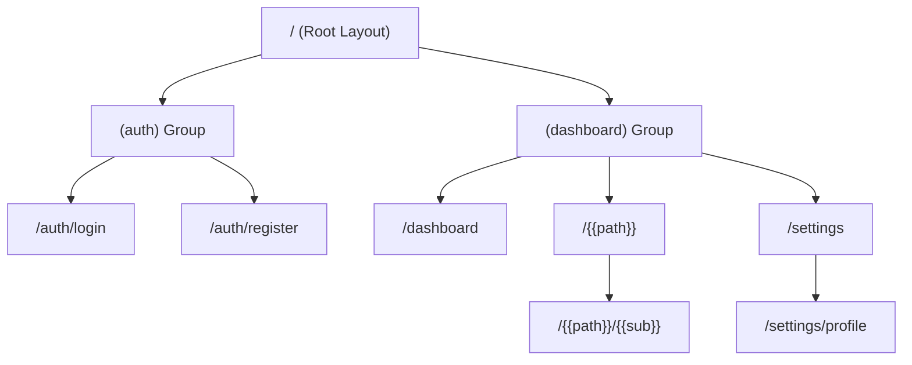

# {{PROJECT_NAME}} Screen Implementation Guide

## 1. Overview

### 1.1 Purpose

{{화면 구현 가이드의 목적. 2_Screen_UX.md의 설계를 실제 코드로 변환하기 위한 상세 구현 명세를 제공한다.}}

### 1.2 Tech Stack

| Item | Value |
|------|-------|
| Framework | Next.js App Router |
| Styling | CSS Modules + Design Tokens |
| Data Fetching | react-query |
| State Management | React Server Components + Client State |

---

## 2. Screen Implementation

### 2.1 S-0010: {{Screen Name}}

**Route**: `app/{{path}}/page.tsx`
**Type**: Server Component | Client Component
**Related FR**: FR-XXX

#### File Structure

```
app/{{path}}/
├── page.tsx              # 페이지 컴포넌트
├── layout.tsx            # 레이아웃 (optional)
├── loading.tsx           # 로딩 UI
├── error.tsx             # 에러 UI
└── components/
    ├── {{Component}}.tsx
    └── {{Component}}.module.css
```

#### Data Requirements

| Data | Source | Hook | Cache |
|------|--------|------|-------|
| {{데이터}} | `GET /api/{{resource}}` | `use{{Resource}}()` | 30s stale |
| {{데이터}} | `POST /api/{{resource}}` | `useCreate{{Resource}}()` | invalidate |

#### State Management

| State | Type | Initial | Trigger |
|-------|------|---------|---------|
| {{상태}} | local | {{초기값}} | {{트리거}} |
| {{상태}} | server | fetched | mount |

#### Implementation Notes

- {{구현 시 주의사항}}
- {{성능 최적화 포인트}}
- {{접근성 고려사항}}

---

## 3. Component Decision Flow



---

## 4. Routing Map

| Screen ID | Route | Page File | Menu ID | Guard |
|-----------|-------|-----------|---------|-------|
| S-0010 | `/` | `app/page.tsx` | MN-XXX-NNNN | - |
| S-0020 | `/dashboard` | `app/dashboard/page.tsx` | MN-XXX-NNNN | auth |
| S-0030 | `/{{path}}` | `app/{{path}}/page.tsx` | MN-XXX-NNNN | {{guard}} |

---

## 5. Route Hierarchy



---

## 6. Shared Layouts

| Layout | Route Group | Components |
|--------|-----------|-----------|
| Root | `app/layout.tsx` | Header, Footer |
| Dashboard | `app/(dashboard)/layout.tsx` | Sidebar, Header |
| Auth | `app/(auth)/layout.tsx` | AuthHeader |

---

## Change Log

| Version | Date | Author | Description |
|---------|------|--------|-------------|
| v0.1.0 | {{DATE}} | u-UX | Initial draft |
