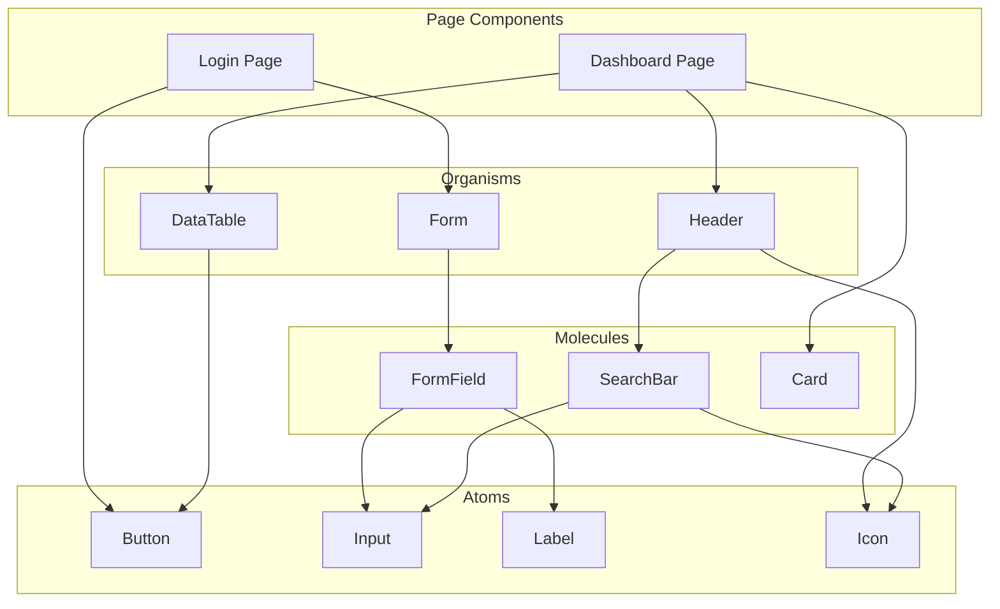

# {{PROJECT_NAME}} UI Components Specification

## 1. Overview

### 1.1 Purpose

{{UI 컴포넌트 명세의 목적. packages/ui에 구현할 재사용 컴포넌트의 Props, Variants, Storybook 가이드를 정의한다.}}

### 1.2 Component Path

```
packages/ui/src/
├── [Component]/
│   ├── [Component].tsx
│   ├── [Component].module.css
│   └── [Component].stories.tsx
└── index.ts
```

---

## 2. Component Specifications

### 2.1 Button

**Package**: `packages/ui/src/Button`

#### Props

| Prop | Type | Default | Required | Description |
|------|------|---------|----------|-------------|
| variant | `'primary' \| 'secondary' \| 'outline' \| 'ghost' \| 'danger'` | `'primary'` | N | 버튼 스타일 |
| size | `'sm' \| 'md' \| 'lg'` | `'md'` | N | 버튼 크기 |
| disabled | `boolean` | `false` | N | 비활성 상태 |
| loading | `boolean` | `false` | N | 로딩 상태 |
| icon | `ReactNode` | - | N | 아이콘 |
| children | `ReactNode` | - | Y | 버튼 텍스트 |
| onClick | `() => void` | - | N | 클릭 핸들러 |

#### Storybook Stories

```
- Default
- Variants (primary, secondary, outline, ghost, danger)
- Sizes (sm, md, lg)
- Loading state
- Disabled state
- With icon
```

### 2.2 Input

**Package**: `packages/ui/src/Input`

#### Props

| Prop | Type | Default | Required | Description |
|------|------|---------|----------|-------------|
| type | `'text' \| 'email' \| 'password' \| 'number'` | `'text'` | N | 입력 타입 |
| label | `string` | - | N | 라벨 텍스트 |
| placeholder | `string` | - | N | 플레이스홀더 |
| value | `string` | - | Y | 입력값 |
| onChange | `(value: string) => void` | - | Y | 변경 핸들러 |
| error | `string` | - | N | 에러 메시지 |
| disabled | `boolean` | `false` | N | 비활성 상태 |

### 2.3 {{Component Name}}

**Package**: `packages/ui/src/{{Component}}`

#### Props

| Prop | Type | Default | Required | Description |
|------|------|---------|----------|-------------|
| {{prop}} | {{type}} | {{default}} | {{Y/N}} | {{설명}} |

---

## 3. Component Dependency Tree



---

## 4. Component Status

| Component | Design | Implementation | Storybook | Tests |
|-----------|--------|---------------|-----------|-------|
| Button | Done | {{STATUS}} | {{STATUS}} | {{STATUS}} |
| Input | Done | {{STATUS}} | {{STATUS}} | {{STATUS}} |
| Card | Done | {{STATUS}} | {{STATUS}} | {{STATUS}} |
| {{Component}} | {{STATUS}} | {{STATUS}} | {{STATUS}} | {{STATUS}} |

---

## 5. Storybook Configuration

### 4.1 Story Template

```typescript
import type { Meta, StoryObj } from '@storybook/react';
import { {{Component}} } from './{{Component}}';

const meta: Meta<typeof {{Component}}> = {
  title: 'UI/{{Component}}',
  component: {{Component}},
  tags: ['autodocs'],
};

export default meta;
type Story = StoryObj<typeof {{Component}}>;

export const Default: Story = {
  args: {
    // default props
  },
};
```

---

## Change Log

| Version | Date | Author | Description |
|---------|------|--------|-------------|
| v0.1.0 | {{DATE}} | u-UX | Initial draft |
