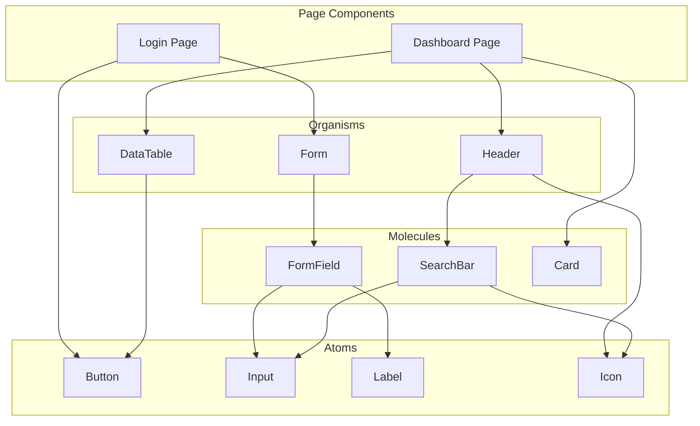

# {{PROJECT_NAME}} UI Components Specification

## 1. Overview

### 1.1 Purpose

{{UI 컴포넌트 명세의 목적. packages/ui에 구현할 재사용 컴포넌트의 Props, Variants, Storybook 가이드를 정의한다.}}

### 1.2 Component Path

```
packages/ui/src/
├── [Component]/
│   ├── [Component].tsx
│   ├── [Component].module.css
│   └── [Component].stories.tsx
└── index.ts
```

### 1.3 Implementation Status Legend

| Symbol | Status | Description |
|--------|--------|-------------|
| ✅ | Done | 구현 완료 |
| ⏳ | In Progress | 구현 중 |
| ❌ | Not Started | 미구현 |

---

## 2. Component Master List

> 전체 컴포넌트 목록과 구현 상태를 한 눈에 확인한다.

| Component | Category | Impl. | Storybook | Tests | Related Screen |
|-----------|----------|-------|-----------|-------|----------------|
| Button | Atom | ✅ Done | ✅ Done | ✅ Done | 전체 |
| Input | Atom | ✅ Done | ✅ Done | ❌ Not Started | S-001, S-007 |
| Card | Molecule | ⏳ In Progress | ❌ Not Started | ❌ Not Started | S-002, S-003 |
| {{Component}} | {{Category}} | ❌ Not Started | ❌ Not Started | ❌ Not Started | {{Screens}} |

**전체 진행률**: {{N}}/{{TOTAL}} 구현 완료 ({{PERCENT}}%)

---

## 3. Component Specifications

### 3.1 Button

**Package**: `packages/ui/src/Button`
**Status**: ✅ Implementation Done | ✅ Storybook Done | ✅ Tests Done
**Related Screens**: 전체 화면

#### Props

| Prop | Type | Default | Required | Description |
|------|------|---------|----------|-------------|
| variant | `'primary' \| 'secondary' \| 'outline' \| 'ghost' \| 'danger'` | `'primary'` | N | 버튼 스타일 변형 |
| size | `'sm' \| 'md' \| 'lg'` | `'md'` | N | 버튼 크기 |
| disabled | `boolean` | `false` | N | 비활성 상태 (클릭 불가, opacity 감소) |
| loading | `boolean` | `false` | N | 로딩 상태 (스피너 표시, 클릭 불가) |
| icon | `ReactNode` | `undefined` | N | 버튼 좌측에 표시할 아이콘 요소 |
| children | `ReactNode` | - | Y | 버튼 내부 텍스트 또는 컨텐츠 |
| onClick | `(event: React.MouseEvent) => void` | `undefined` | N | 클릭 이벤트 핸들러 |
| type | `'button' \| 'submit' \| 'reset'` | `'button'` | N | HTML button type 속성 |
| className | `string` | `''` | N | 추가 CSS 클래스 |

#### Storybook Stories

```
- Default (primary, md)
- Variants: primary / secondary / outline / ghost / danger
- Sizes: sm / md / lg
- Loading state (로딩 스피너)
- Disabled state
- With icon (좌측 아이콘)
- Full width
```

---

### 3.2 Input

**Package**: `packages/ui/src/Input`
**Status**: ✅ Implementation Done | ✅ Storybook Done | ❌ Tests Not Started
**Related Screens**: S-001 (로그인), S-007 (회원가입)

#### Props

| Prop | Type | Default | Required | Description |
|------|------|---------|----------|-------------|
| type | `'text' \| 'email' \| 'password' \| 'number' \| 'tel'` | `'text'` | N | HTML input 타입 |
| label | `string` | `undefined` | N | 입력 필드 상단 라벨 텍스트 |
| placeholder | `string` | `''` | N | 빈 상태 플레이스홀더 텍스트 |
| value | `string` | - | Y | 제어 컴포넌트 값 (controlled) |
| onChange | `(value: string) => void` | - | Y | 값 변경 핸들러 |
| error | `string` | `undefined` | N | 에러 메시지 (표시 시 테두리 빨간색) |
| hint | `string` | `undefined` | N | 입력 힌트 텍스트 (필드 하단) |
| disabled | `boolean` | `false` | N | 비활성 상태 |
| required | `boolean` | `false` | N | 필수 입력 여부 (라벨 옆 * 표시) |
| maxLength | `number` | `undefined` | N | 최대 입력 길이 |
| className | `string` | `''` | N | 추가 CSS 클래스 |

---

### 3.3 {{Component Name}}

**Package**: `packages/ui/src/{{Component}}`
**Status**: ❌ Implementation Not Started | ❌ Storybook Not Started | ❌ Tests Not Started
**Related Screens**: {{관련 화면 ID 목록}}

#### Props

| Prop | Type | Default | Required | Description |
|------|------|---------|----------|-------------|
| {{prop}} | {{type}} | {{default}} | {{Y/N}} | {{상세 설명: 무엇을 하는 prop인지, 어떤 값이 유효한지}} |

---

## 4. Component Dependency Tree



---

## 5. Storybook Configuration

### 5.1 Story Template

```typescript
import type { Meta, StoryObj } from '@storybook/react';
import { {{Component}} } from './{{Component}}';

const meta: Meta<typeof {{Component}}> = {
  title: 'UI/{{Component}}',
  component: {{Component}},
  tags: ['autodocs'],
};

export default meta;
type Story = StoryObj<typeof {{Component}}>;

export const Default: Story = {
  args: {
    // default props
  },
};
```

---

## Change Log

| Version | Date | Author | Description |
|---------|------|--------|-------------|
| v0.1.0 | {{DATE}} | u-UX | Initial draft |
