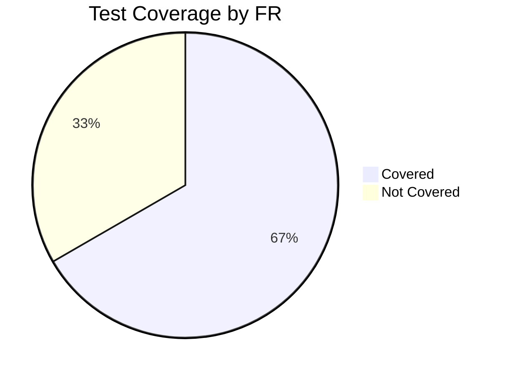

# {{PROJECT_NAME}} Test Cases

## 1. Background

### 1.1 Purpose

{{테스트 케이스 문서의 목적. SRS의 FR을 기반으로 테스트 케이스를 설계한다.}}

### 1.2 Test Strategy

| Item | Value |
|------|-------|
| Test Types | Unit, Integration, E2E |
| Coverage Target | 80%+ |
| Tools | Vitest (Unit), Playwright (E2E) |
| Environment | Local + CI |

---

## 2. Test Conditions

### 2.1 Prerequisites

| # | Condition | Description |
|---|-----------|-------------|
| PRE-001 | 빌드 성공 | `bun run build` 성공 상태 |
| PRE-002 | DB 초기화 | 테스트 DB 시딩 완료 |
| PRE-003 | 환경 변수 | `.env.test` 설정 완료 |
| PRE-004 | {{조건}} | {{설명}} |

### 2.2 Test Data

| Data Set | Description | Records |
|----------|-------------|---------|
| Users | 테스트 사용자 계정 | admin@test.com, user@test.com |
| {{데이터셋}} | {{설명}} | {{데이터}} |

---

## 3. Test Cases

### 3.1 FR-001: {{기능명}}

#### TC-001: {{테스트명}}

| Field | Value |
|-------|-------|
| **TC-ID** | TC-001 |
| **FR Mapping** | FR-001 |
| **Type** | Integration |
| **Priority** | Critical |
| **Precondition** | PRE-001, PRE-002 |

**Test Steps**:

| Step | Action | Expected Result |
|------|--------|----------------|
| 1 | {{액션 1}} | {{기대 결과 1}} |
| 2 | {{액션 2}} | {{기대 결과 2}} |
| 3 | {{액션 3}} | {{기대 결과 3}} |

#### TC-002: {{테스트명 - 에러 케이스}}

| Field | Value |
|-------|-------|
| **TC-ID** | TC-002 |
| **FR Mapping** | FR-001 |
| **Type** | Integration |
| **Priority** | Major |
| **Precondition** | PRE-001 |

**Test Steps**:

| Step | Action | Expected Result |
|------|--------|----------------|
| 1 | {{잘못된 입력}} | {{에러 응답}} |

### 3.2 FR-002: {{기능명}}

#### TC-003: {{테스트명}}

| Field | Value |
|-------|-------|
| **TC-ID** | TC-003 |
| **FR Mapping** | FR-002 |
| **Type** | E2E |
| **Priority** | Major |
| **Precondition** | PRE-001, PRE-002, PRE-003 |

**Test Steps**:

| Step | Action | Expected Result |
|------|--------|----------------|
| 1 | {{액션}} | {{기대 결과}} |

---

## 4. Test Case Summary

| TC-ID | FR | Type | Priority | Description |
|-------|-----|------|----------|-------------|
| TC-001 | FR-001 | Integration | Critical | {{설명}} |
| TC-002 | FR-001 | Integration | Major | {{설명}} |
| TC-003 | FR-002 | E2E | Major | {{설명}} |

---

## 5. Coverage Matrix

| FR-ID | Feature | Test Cases | Coverage |
|-------|---------|-----------|----------|
| FR-001 | {{기능명}} | TC-001, TC-002 | Covered |
| FR-002 | {{기능명}} | TC-003 | Covered |
| FR-003 | {{기능명}} | - | Not Covered |

---

## 6. Evidence Requirements

| TC-ID | Evidence Type | Location |
|-------|-------------|----------|
| TC-001 | API Response Log | `u-docs/assets/tc-001-response.log` |
| TC-002 | Error Screenshot | `u-docs/assets/tc-002-error.png` |
| TC-003 | E2E Recording | `u-docs/assets/tc-003-recording.mp4` |

---

## Change Log

| Version | Date | Author | Description |
|---------|------|--------|-------------|
| v0.1.0 | {{DATE}} | u-QA-A | Initial draft |
