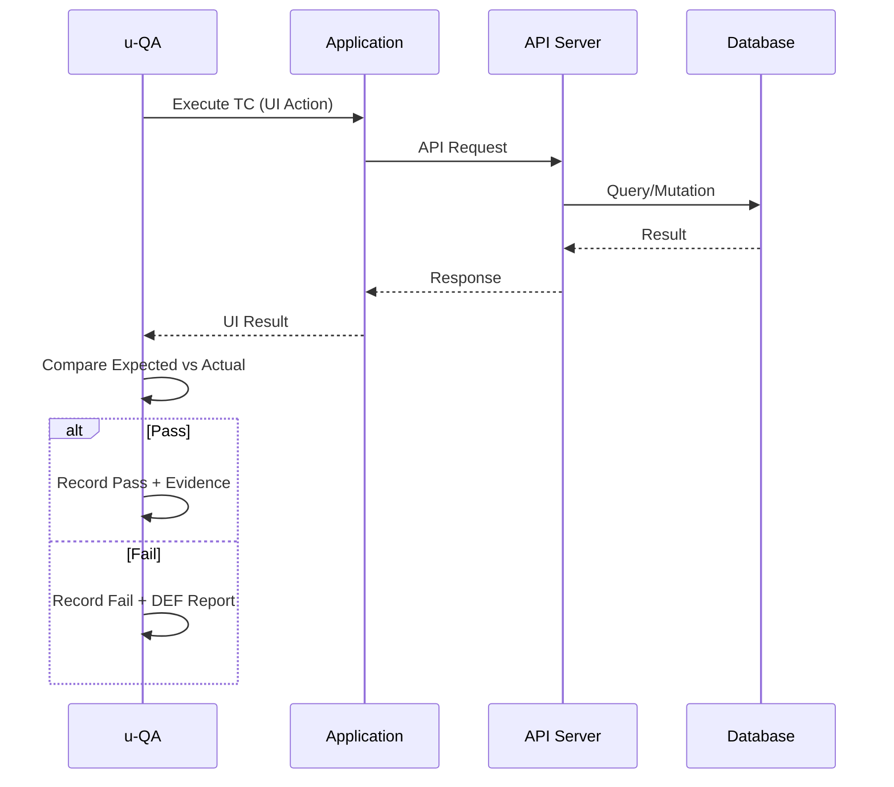
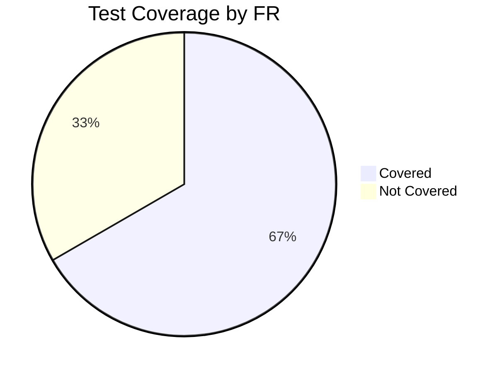

# {{PROJECT_NAME}} Test Cases

## 1. Background

### 1.1 Purpose

{{테스트 케이스 문서의 목적. SRS의 FR을 기반으로 테스트 케이스를 설계한다.}}

### 1.2 Test Strategy

| Item | Value |
|------|-------|
| Test Types | Unit, Integration, E2E |
| Coverage Target | 80%+ |
| Tools | Vitest (Unit), Playwright (E2E) |
| Environment | Local + CI |

---

## 2. Test Conditions

### 2.1 Prerequisites

| # | Condition | Description |
|---|-----------|-------------|
| PRE-001 | 빌드 성공 | `bun run build` 성공 상태 |
| PRE-002 | DB 초기화 | 테스트 DB 시딩 완료 |
| PRE-003 | 환경 변수 | `.env.test` 설정 완료 |
| PRE-004 | {{조건}} | {{설명}} |

### 2.2 Test Data

| Data Set | Description | Records |
|----------|-------------|---------|
| Users | 테스트 사용자 계정 | admin@test.com, user@test.com |
| {{데이터셋}} | {{설명}} | {{데이터}} |

---

## 3. Test Cases

> **시나리오 작성 규칙**: 각 테스트 스텝은 "누가(Actor) — 어떤 화면(Screen)에서 — 어떤 요소(Element)를 — 어떻게 조작하고(Action) — 어떤 값을 입력(Input)하여 — 무엇을 기대하는가(Expected)"를 구체적으로 기술한다.

### 3.1 FR-001: {{기능명}}

#### TC-001: {{테스트명 - 정상 케이스}}

| Field | Value |
|-------|-------|
| **TC-ID** | TC-001 |
| **FR Mapping** | FR-001 |
| **SC Mapping** | SC-001 |
| **Type** | Positive \| Integration |
| **Priority** | Critical |
| **Actor** | {{사용자 유형 — 예: 일반 사용자, 관리자}} |
| **Precondition** | PRE-001, PRE-002 |

**Test Steps**:

| Step | Screen | Element | Action | Input Value | Expected Result |
|------|--------|---------|--------|-------------|----------------|
| 1 | {{화면명 예: 로그인 화면 (S-001)}} | {{요소명 예: 이메일 입력 필드}} | {{동작 예: 클릭 후 입력}} | {{입력값 예: user@test.com}} | {{기대 결과 예: 커서가 이메일 필드로 이동}} |
| 2 | {{화면명}} | {{요소명 예: 비밀번호 입력 필드}} | {{동작}} | {{입력값 예: Password123!}} | {{기대 결과}} |
| 3 | {{화면명}} | {{요소명 예: 로그인 버튼}} | {{동작 예: 클릭}} | - | {{기대 결과 예: 대시보드(S-002)로 이동}} |

**Result**: [ ] Pass / [ ] Fail / [ ] Skip
**Note**: -

#### TC-002: {{테스트명 - 에러 케이스}}

| Field | Value |
|-------|-------|
| **TC-ID** | TC-002 |
| **FR Mapping** | FR-001 |
| **SC Mapping** | SC-001 |
| **Type** | Negative \| Integration |
| **Priority** | Major |
| **Actor** | {{사용자 유형}} |
| **Precondition** | PRE-001 |

**Test Steps**:

| Step | Screen | Element | Action | Input Value | Expected Result |
|------|--------|---------|--------|-------------|----------------|
| 1 | {{화면명 예: 로그인 화면 (S-001)}} | {{요소명 예: 이메일 입력 필드}} | {{동작 예: 클릭 후 입력}} | {{잘못된 값 예: invalid-email}} | {{기대 결과 예: 필드 테두리가 빨간색으로 변경}} |
| 2 | {{화면명}} | {{요소명 예: 로그인 버튼}} | 클릭 | - | {{기대 결과 예: "올바른 이메일 형식을 입력하세요" 에러 메시지 표시}} |

**Result**: [ ] Pass / [ ] Fail / [ ] Skip
**Note**: -

### 3.2 FR-002: {{기능명}}

#### TC-003: {{테스트명 - E2E 시나리오}}

| Field | Value |
|-------|-------|
| **TC-ID** | TC-003 |
| **FR Mapping** | FR-002 |
| **SC Mapping** | SC-002 |
| **Type** | Positive \| E2E |
| **Priority** | Major |
| **Actor** | {{사용자 유형}} |
| **Precondition** | PRE-001, PRE-002, PRE-003 |

**Test Steps**:

| Step | Screen | Element | Action | Input Value | Expected Result |
|------|--------|---------|--------|-------------|----------------|
| 1 | {{화면명}} | {{요소명}} | {{동작}} | {{입력값}} | {{기대 결과}} |
| 2 | {{화면명}} | {{요소명}} | {{동작}} | {{입력값}} | {{기대 결과}} |

**Result**: [ ] Pass / [ ] Fail / [ ] Skip
**Note**: -

---

## 4. Test Case Summary

| TC-ID | FR | SC | Type | Priority | Actor | Description | Result |
|-------|-----|-----|------|----------|-------|-------------|--------|
| TC-001 | FR-001 | SC-001 | Positive/Integration | Critical | {{Actor}} | {{설명}} | [ ] |
| TC-002 | FR-001 | SC-001 | Negative/Integration | Major | {{Actor}} | {{설명}} | [ ] |
| TC-003 | FR-002 | SC-002 | Positive/E2E | Major | {{Actor}} | {{설명}} | [ ] |

---

## 5. Test Execution Flow

---

## 6. Coverage Matrix

| FR-ID | Feature | Test Cases | Coverage |
|-------|---------|-----------|----------|
| FR-001 | {{기능명}} | TC-001, TC-002 | Covered |
| FR-002 | {{기능명}} | TC-003 | Covered |
| FR-003 | {{기능명}} | - | Not Covered |

---

## 7. Evidence Requirements

| TC-ID | Evidence Type | Location |
|-------|-------------|----------|
| TC-001 | API Response Log | `u-docs/assets/tc-001-response.log` |
| TC-002 | Error Screenshot | `u-docs/assets/tc-002-error.png` |
| TC-003 | E2E Recording | `u-docs/assets/tc-003-recording.mp4` |

---

## Change Log

| Version | Date | Author | Description |
|---------|------|--------|-------------|
| v0.1.0 | {{DATE}} | u-QA | Initial draft |
