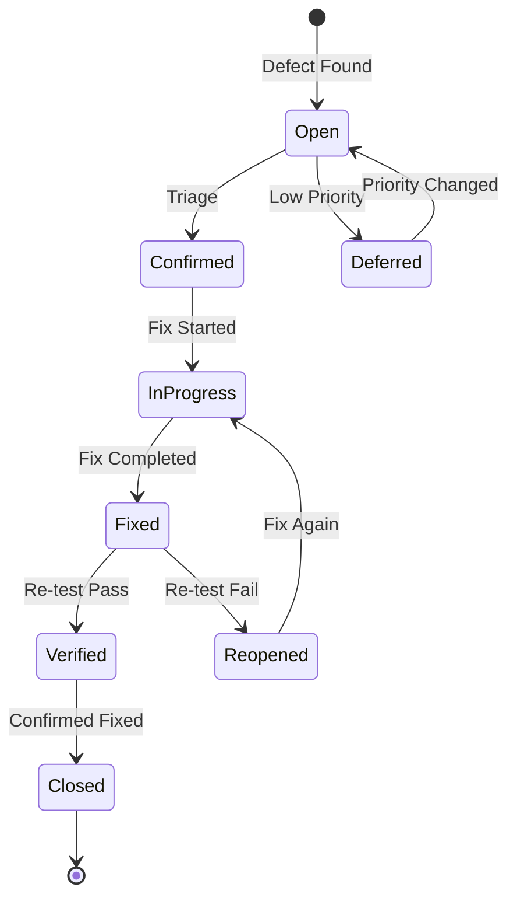
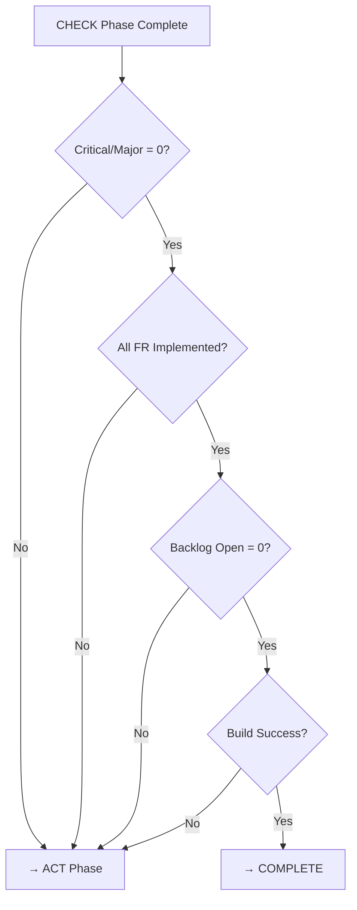

# {{PROJECT_NAME}} QA Report

## 1. Background

### 1.1 Purpose

{{QA 리포트 문서의 목적. 테스트 실행 결과를 기록하고 결함을 분석한다.}}

### 1.2 Test Execution Summary

| Item | Value |
|------|-------|
| Iteration | {{ITERATION}} |
| Test Date | {{DATE}} |
| Tester | u-QA |
| Environment | Local / CI |
| Build Version | {{BUILD_VERSION}} |

---

## 2. Test Results

### 2.1 Execution Summary

| Metric | Value |
|--------|-------|
| Total Test Cases | {{TOTAL}} |
| Passed | {{PASS}} |
| Failed | {{FAIL}} |
| Skipped | {{SKIP}} |
| Pass Rate | {{PASS_RATE}}% |

### 2.2 Results by FR

| FR-ID | Feature | Total | Pass | Fail | Skip | Status |
|-------|---------|-------|------|------|------|--------|
| FR-0010 | {{기능명}} | 2 | 1 | 1 | 0 | Partial |
| FR-0020 | {{기능명}} | 1 | 1 | 0 | 0 | Pass |
| FR-0030 | {{기능명}} | 1 | 0 | 0 | 1 | Skip |

---

## 3. Actual vs Expected

| TC-ID | FR | Expected | Actual | Result | Evidence |
|-------|-----|----------|--------|--------|----------|
| TC-0010 | FR-0010 | {{기대 결과}} | {{실제 결과}} | Pass | [Log](u-docs/assets/tc-0010.log) |
| TC-0020 | FR-0010 | {{기대 결과}} | {{실제 결과}} | Fail | [Screenshot](u-docs/assets/tc-0020.png) |
| TC-0030 | FR-0020 | {{기대 결과}} | {{실제 결과}} | Pass | [Log](u-docs/assets/tc-0030.log) |

---

## 4. Defect Report

### 4.1 Defect Summary

| Severity | Count |
|----------|-------|
| Critical | {{COUNT}} |
| Major | {{COUNT}} |
| Minor | {{COUNT}} |
| Trivial | {{COUNT}} |
| **Total** | **{{TOTAL}}** |

### 4.2 Defect Lifecycle

### 4.3 Defect Details

#### DEF-0010: {{결함 제목}}

| Field | Value |
|-------|-------|
| **DEF-ID** | DEF-0010 |
| **Severity** | Critical / Major / Minor / Trivial |
| **TC-ID** | TC-0020 |
| **FR-ID** | FR-0010 |
| **Status** | Open |
| **Found Date** | {{DATE}} |
| **Found By** | u-QA |

**Description**: {{결함 상세 설명}}

**Steps to Reproduce**:
1. {{재현 단계 1}}
2. {{재현 단계 2}}

**Expected**: {{기대 결과}}

**Actual**: {{실제 결과}}

**Evidence**: [Screenshot](u-docs/assets/def-0010.png)

**Root Cause**: {{원인 분석 (u-QA이 작성)}}

**Fix Suggestion**: {{수정 제안}}

---

## 5. Evidence

| TC-ID | Evidence Type | Path | Status |
|-------|-------------|------|--------|
| TC-0010 | API Response Log | `u-docs/assets/tc-0010.log` | Collected |
| TC-0020 | Error Screenshot | `u-docs/assets/tc-0020.png` | Collected |

---

## 6. Test Conditions Verification

| # | Condition | Status | Notes |
|---|-----------|--------|-------|
| PRE-0010 | 빌드 성공 | Pass | `bun run build` OK |
| PRE-0020 | DB 초기화 | Pass | Seed data loaded |
| PRE-0030 | 환경 변수 | Pass | `.env.test` configured |

---

## 7. Exit Criteria Decision Flow

## 8. Exit Criteria Check

| # | Criteria | Status | Value |
|---|---------|--------|-------|
| 1 | All backlog items Done | {{PASS/FAIL}} | {{open count}} open |
| 2 | No Critical/Major defects | {{PASS/FAIL}} | {{count}} remaining |
| 3 | All FR implemented | {{PASS/FAIL}} | {{count}} remaining |
| 4 | Build success | {{PASS/FAIL}} | {{result}} |
| **Overall** | | **{{PASS/FAIL}}** | |

---

## Change Log

| Version | Date | Author | Description |
|---------|------|--------|-------------|
| v0.1.0 | {{DATE}} | u-QA | Initial draft |
