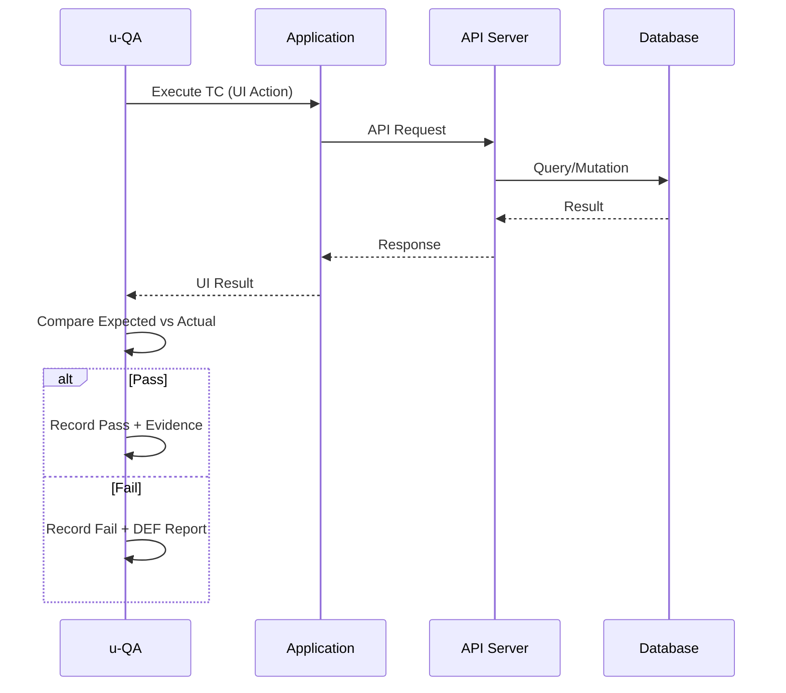
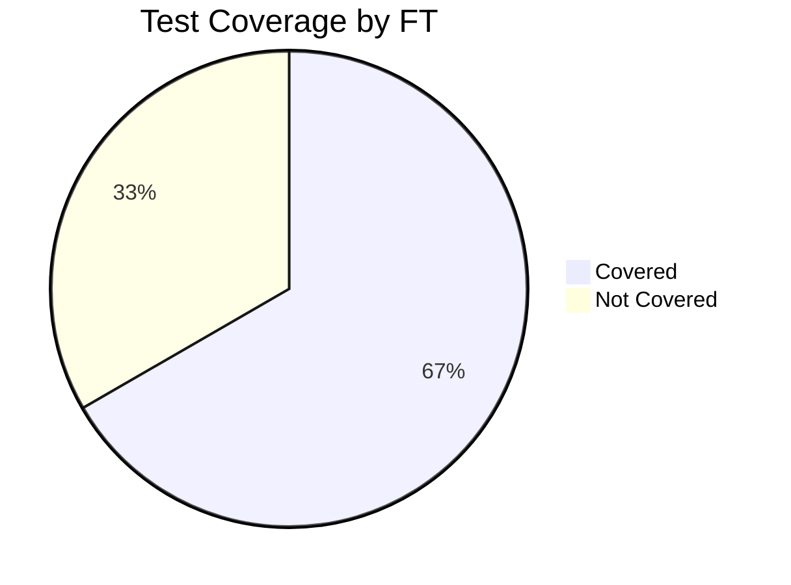

# {{PROJECT_NAME}} Test Cases

## 1. Background

### 1.1 Purpose

{{테스트 케이스 문서의 목적. SRS의 FT를 기반으로 테스트 케이스를 설계한다.}}

### 1.2 Test Strategy

| Item | Value |
|------|-------|
| Test Types | Unit, E2E |
| Coverage Target | 80%+ |
| Tools | Vitest (Unit), Playwright (E2E) |
| Environment | Local + CI |

---

## 2. Test Conditions

### 2.1 Prerequisites

| # | Condition | Description |
|---|-----------|-------------|
| PRE-0010 | 빌드 성공 | `bun run build` 성공 상태 |
| PRE-0020 | DB 초기화 | 테스트 DB 시딩 완료 |
| PRE-0030 | 환경 변수 | `.env.test` 설정 완료 |
| PRE-0040 | {{조건}} | {{설명}} |

### 2.2 Test Data

| Data Set | Description | Records |
|----------|-------------|---------|
| Users | 테스트 사용자 계정 | admin@test.com, user@test.com |
| {{데이터셋}} | {{설명}} | {{데이터}} |

---

## 3. Test Cases

> **시나리오 작성 규칙**: 각 테스트 스텝은 "누가(Actor) — 어떤 화면(Screen)에서 — 어떤 요소(Element)를 — 어떻게 조작하고(Action) — 어떤 값을 입력(Input)하여 — 무엇을 기대하는가(Expected)"를 구체적으로 기술한다.
>
> **필수 규칙**:
> - 모든 FT는 반드시 Unit Test 케이스와 E2E Test 케이스를 모두 포함한다.
> - 각 FT의 Unit 케이스는 최소 2개(정상 1 + 비정상/경계 1 이상), E2E 케이스는 최소 2개(성공 여정 1 + 실패/예외 1 이상) 작성한다.
> - Expected Result는 UI/API/DB 중 최소 1개 이상의 검증 포인트를 포함한다.

### 3.1 FT-0010: {{기능명}}

#### TC-0010: {{테스트명 - 정상 케이스}}

| Field | Value |
|-------|-------|
| **TC-ID** | TC-0010 |
| **FT Mapping** | [FT-0010](../01-plan/1_SRS_RA.md#ft-0010) |
| **US Mapping** | [US-0010](../01-plan/1_SRS_RA.md#us-0010) |
| **Level** | Unit |
| **Type** | Positive |
| **Priority** | Critical |
| **Actor** | {{사용자 유형 — 예: 일반 사용자, 관리자}} |
| **Precondition** | PRE-0010, PRE-0020 |
| **Automation Target** | Vitest |

**Test Steps**:

| Step | Screen | Element | Action | Input Value | Expected Result |
|------|--------|---------|--------|-------------|----------------|
| 1 | {{화면명 예: 로그인 화면 (S-0010)}} | {{요소명 예: 이메일 입력 필드}} | {{동작 예: 클릭 후 입력}} | {{입력값 예: user@test.com}} | {{기대 결과 예: 커서가 이메일 필드로 이동}} |
| 2 | {{화면명}} | {{요소명 예: 비밀번호 입력 필드}} | {{동작}} | {{입력값 예: Password123!}} | {{기대 결과}} |
| 3 | {{화면명}} | {{요소명 예: 로그인 버튼}} | {{동작 예: 클릭}} | - | {{기대 결과 예: 대시보드(S-0020)로 이동}} |

**Result**: [ ] Pass / [ ] Fail / [ ] Skip
**Note**: -

#### TC-0020: {{테스트명 - 에러 케이스}}

| Field | Value |
|-------|-------|
| **TC-ID** | TC-0020 |
| **FT Mapping** | [FT-0010](../01-plan/1_SRS_RA.md#ft-0010) |
| **US Mapping** | [US-0010](../01-plan/1_SRS_RA.md#us-0010) |
| **Level** | Unit |
| **Type** | Negative \| Boundary |
| **Priority** | Major |
| **Actor** | {{사용자 유형}} |
| **Precondition** | PRE-0010 |
| **Automation Target** | Vitest |

**Test Steps**:

| Step | Screen | Element | Action | Input Value | Expected Result |
|------|--------|---------|--------|-------------|----------------|
| 1 | {{화면명 예: 로그인 화면 (S-0010)}} | {{요소명 예: 이메일 입력 필드}} | {{동작 예: 클릭 후 입력}} | {{잘못된 값 예: invalid-email}} | {{기대 결과 예: 필드 테두리가 빨간색으로 변경}} |
| 2 | {{화면명}} | {{요소명 예: 로그인 버튼}} | 클릭 | - | {{기대 결과 예: "올바른 이메일 형식을 입력하세요" 에러 메시지 표시}} |

**Result**: [ ] Pass / [ ] Fail / [ ] Skip
**Note**: -

### 3.2 FT-0020: {{기능명}}

#### TC-0030: {{테스트명 - E2E 시나리오}}

| Field | Value |
|-------|-------|
| **TC-ID** | TC-0030 |
| **FT Mapping** | FT-0020 |
| **US Mapping** | US-0020 |
| **Level** | E2E |
| **Type** | Positive |
| **Priority** | Major |
| **Actor** | {{사용자 유형}} |
| **Precondition** | PRE-0010, PRE-0020, PRE-0030 |
| **Automation Target** | Playwright |

**Test Steps**:

| Step | Screen | Element | Action | Input Value | Expected Result |
|------|--------|---------|--------|-------------|----------------|
| 1 | {{화면명}} | {{요소명}} | {{동작}} | {{입력값}} | {{기대 결과}} |
| 2 | {{화면명}} | {{요소명}} | {{동작}} | {{입력값}} | {{기대 결과}} |

**Result**: [ ] Pass / [ ] Fail / [ ] Skip
**Note**: -

#### TC-0040: {{테스트명 - E2E 실패/예외 시나리오}}

| Field | Value |
|-------|-------|
| **TC-ID** | TC-0040 |
| **FT Mapping** | FT-0020 |
| **US Mapping** | US-0020 |
| **Level** | E2E |
| **Type** | Negative \| Boundary |
| **Priority** | Major |
| **Actor** | {{사용자 유형}} |
| **Precondition** | PRE-0010, PRE-0020, PRE-0030 |
| **Automation Target** | Playwright |

**Test Steps**:

| Step | Screen | Element | Action | Input Value | Expected Result |
|------|--------|---------|--------|-------------|----------------|
| 1 | {{화면명}} | {{요소명}} | {{동작}} | {{비정상/경계 입력값}} | {{검증 포인트: 에러 메시지/차단 동작/API 에러 코드}} |
| 2 | {{화면명}} | {{요소명}} | {{동작}} | - | {{검증 포인트: 화면 상태 유지, 잘못된 데이터 미저장, 로깅 기록}} |

**Result**: [ ] Pass / [ ] Fail / [ ] Skip
**Note**: -

---

## 4. Test Case Summary

| TC-ID | FT | US | Level | Type | Priority | Actor | Description | Result |
|-------|----|----|-------|------|----------|-------|-------------|--------|
| TC-0010 | FT-0010 | US-0010 | Unit | Positive | Critical | {{Actor}} | {{설명}} | [ ] |
| TC-0020 | FT-0010 | US-0010 | Unit | Negative/Boundary | Major | {{Actor}} | {{설명}} | [ ] |
| TC-0030 | FT-0020 | US-0020 | E2E | Positive | Major | {{Actor}} | {{설명}} | [ ] |
| TC-0040 | FT-0020 | US-0020 | E2E | Negative/Boundary | Major | {{Actor}} | {{설명}} | [ ] |

---

## 5. Test Execution Flow

---

## 6. Coverage Matrix

| FT-ID | Feature | Unit Cases | E2E Cases | Coverage |
|-------|---------|------------|-----------|----------|
| [FT-0010](../01-plan/1_SRS_RA.md#ft-0010) | {{기능명}} | [TC-0010](#tc-0010), [TC-0020](#tc-0020) | [TC-0030](#tc-0030), [TC-0040](#tc-0040) | Covered |
| [FT-0020](../01-plan/1_SRS_RA.md#ft-0020) | {{기능명}} | [TC-0050](#tc-0050), [TC-0060](#tc-0060) | [TC-0070](#tc-0070), [TC-0080](#tc-0080) | Covered |
| [FT-0030](../01-plan/1_SRS_RA.md#ft-0030) | {{기능명}} | - | - | Not Covered |

---

## 7. Evidence Requirements

| TC-ID | Evidence Type | Location |
|-------|-------------|----------|
| TC-0010 | API Response Log | `.u-maker/docs/assets/tc-0010-response.log` |
| TC-0020 | Error Screenshot | `.u-maker/docs/assets/tc-0020-error.png` |
| TC-0030 | E2E Recording | `.u-maker/docs/assets/tc-0030-recording.mp4` |

---

## Change Log

| Version | Date | Author | Description |
|---------|------|--------|-------------|
| v0.1.0 | {{DATE}} | u-QA | Initial draft |
