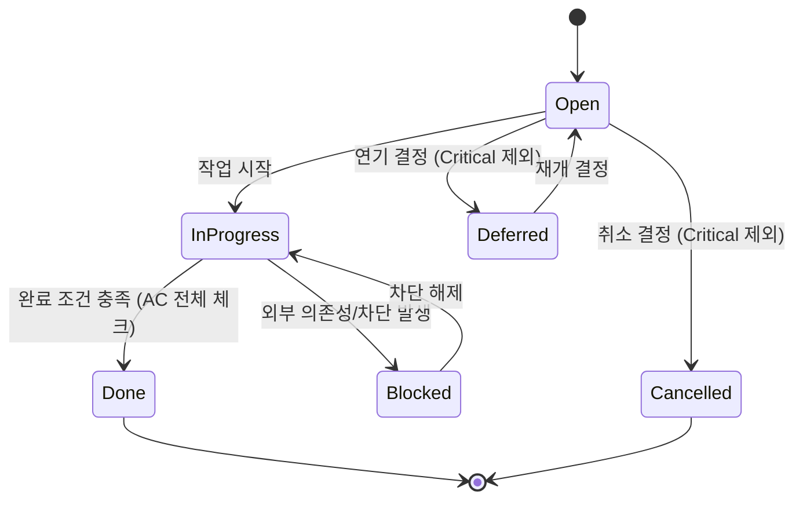

# {{PROJECT_NAME}} Backlog

## 1. Background

### 1.1 Purpose

{{백로그 문서의 목적. CHECK Phase에서 발견된 결함 및 미구현 항목을 정리한다.}}

### 1.2 Summary

| Metric | Value |
|--------|-------|
| Total Items | {{TOTAL}} |
| Open | {{OPEN}} |
| In Progress | {{IN_PROGRESS}} |
| Blocked | {{BLOCKED}} |
| Done | {{DONE}} |
| Deferred | {{DEFERRED}} |
| Cancelled | {{CANCELLED}} |
| Current Iteration | {{ITERATION}} |

<details><summary>JSON Format</summary>

```json
{
  "summary": {
    "totalItems": 0,
    "open": 0,
    "inProgress": 0,
    "blocked": 0,
    "done": 0,
    "deferred": 0,
    "cancelled": 0,
    "currentIteration": "Iter 1"
  }
}
```

</details>

---

## 2. Backlog Table

| BL-ID | Type | Origin | Description | Priority | Status | Related DEF | Iteration | Assignee |
|-------|------|--------|-------------|----------|--------|-------------|-----------|----------|
| BL-001 | Bug | CHECK | {{설명}} | Critical | Open | DEF-001 | Iter {{N}} | {{agent}} |
| BL-002 | Enhancement | DESIGN | {{설명}} | Major | Open | - | Iter {{N}} | {{agent}} |
| BL-003 | Task | DEV | {{설명}} | Minor | Open | - | Iter {{N}} | {{agent}} |

<details><summary>JSON Format (Backlog Item)</summary>

```json
{
  "blId": "BL-001",
  "type": "Bug",
  "origin": "CHECK",
  "description": "설명",
  "priority": "Critical",
  "status": "Open",
  "relatedDef": "DEF-001",
  "iteration": "Iter 1",
  "assignee": "u-dv-be"
}
```

</details>

### 2.1 Status State Machine



**Status Transition Rules:**

| From | To | Condition |
|------|----|-----------|
| Open | InProgress | Assignee가 작업 착수 |
| Open | Deferred | 우선순위 재평가로 연기 (Critical 항목 불가) |
| Open | Cancelled | 요구사항 변경/중복으로 취소 (Critical 항목 불가) |
| InProgress | Blocked | 외부 의존성 또는 다른 BL에 의해 차단 |
| InProgress | Done | 모든 Acceptance Criteria 체크박스 체크 완료 |
| Blocked | InProgress | 차단 사유 해소 |
| Deferred | Open | 연기 항목 재개 결정 |

**Constraints:**
- Critical 항목은 Deferred/Cancelled 상태로 전이 불가
- Done 전이 시 모든 AC 체크박스가 체크되어야 함

<details><summary>JSON Format (Status Transitions)</summary>

```json
{
  "transitions": [
    { "from": "Open", "to": "InProgress", "condition": "Assignee가 작업 착수" },
    { "from": "Open", "to": "Deferred", "condition": "우선순위 재평가로 연기 (Critical 불가)" },
    { "from": "Open", "to": "Cancelled", "condition": "요구사항 변경/중복으로 취소 (Critical 불가)" },
    { "from": "InProgress", "to": "Blocked", "condition": "외부 의존성 또는 다른 BL에 의해 차단" },
    { "from": "InProgress", "to": "Done", "condition": "모든 AC 체크박스 체크 완료" },
    { "from": "Blocked", "to": "InProgress", "condition": "차단 사유 해소" },
    { "from": "Deferred", "to": "Open", "condition": "연기 항목 재개 결정" }
  ],
  "constraints": {
    "criticalNoDeferred": true,
    "criticalNoCancelled": true,
    "doneRequiresAllAcChecked": true
  }
}
```

</details>

---

## 3. Backlog Distribution


## 4. Backlog by Priority

| Priority | Open | InProgress | Blocked | Done | Deferred | Cancelled | Total |
|----------|------|------------|---------|------|----------|-----------|-------|
| Critical | {{N}} | {{N}} | {{N}} | {{N}} | - | - | {{N}} |
| Major | {{N}} | {{N}} | {{N}} | {{N}} | {{N}} | {{N}} | {{N}} |
| Minor | {{N}} | {{N}} | {{N}} | {{N}} | {{N}} | {{N}} | {{N}} |
| Trivial | {{N}} | {{N}} | {{N}} | {{N}} | {{N}} | {{N}} | {{N}} |

---

## 5. Backlog by Origin

| Origin | Count | Description |
|--------|-------|-------------|
| CHECK | {{N}} | QA Phase에서 발견된 결함 |
| DESIGN | {{N}} | 설계 누락 또는 변경 필요 |
| DEV | {{N}} | 개발 과정에서 발견된 이슈 |
| PLAN | {{N}} | 요구사항 변경/추가 |

---

## 6. Backlog Details

### BL-001: {{제목}}

| Field | Value |
|-------|-------|
| **BL-ID** | BL-001 |
| **Type** | Bug |
| **Origin** | CHECK (DEF-001) |
| **Priority** | Critical |
| **Status** | Open |
| **Iteration** | Iter {{N}} |
| **Assignee** | {{agent}} |
| **Related FR** | FR-001 |
| **Related DEF** | DEF-001 |

**Description**: {{상세 설명}}

**Acceptance Criteria**:
- [ ] **Given** {{precondition}}, **When** {{action}}, **Then** {{expected result}}

<details><summary>JSON Format (Backlog Detail)</summary>

```json
{
  "blId": "BL-001",
  "title": "제목",
  "type": "Bug",
  "origin": "CHECK",
  "originRef": "DEF-001",
  "priority": "Critical",
  "status": "Open",
  "iteration": "Iter 1",
  "assignee": "u-dv-be",
  "relatedFr": "FR-001",
  "relatedDef": "DEF-001",
  "description": "상세 설명",
  "acceptanceCriteria": [
    {
      "given": "precondition",
      "when": "action",
      "then": "expected result",
      "checked": false
    }
  ]
}
```

</details>

### BL-002: {{제목}}

| Field | Value |
|-------|-------|
| **BL-ID** | BL-002 |
| **Type** | Enhancement |
| **Origin** | DESIGN |
| **Priority** | Major |
| **Status** | Open |
| **Iteration** | Iter {{N}} |
| **Assignee** | {{agent}} |
| **Related FR** | FR-002 |
| **Related DEF** | - |

**Description**: {{상세 설명}}

**Acceptance Criteria**:
- [ ] **Given** {{precondition}}, **When** {{action}}, **Then** {{expected result}}

---

## 7. Next Iteration Focus

다음 Iteration에서 처리할 항목 (Priority 기준 정렬):

| Order | BL-ID | Priority | Type | Description |
|-------|-------|----------|------|-------------|
| 1 | BL-001 | Critical | Bug | {{설명}} |
| 2 | BL-002 | Major | Enhancement | {{설명}} |
| 3 | BL-003 | Minor | Task | {{설명}} |

---

## 8. Iteration Carry-Over Log

| BL-ID | Status at Iter End | Action | New Iteration | Notes |
|-------|--------------------|--------|---------------|-------|
| BL-001 | Done | Archive | - | 완료, 활성 백로그에서 제거 |
| BL-002 | Open | Carry-Over | Iter {{N+1}} | 우선순위 유지 |
| BL-003 | InProgress | Carry-Over | Iter {{N+1}} | Status를 Open으로 리셋 |
| BL-004 | Blocked | Carry-Over | Iter {{N+1}} | 차단 사유 지속 |
| BL-005 | Deferred | Carry-Over | Iter {{N+1}} | 연기 상태 유지 |
| BL-006 | Cancelled | Purge | - | 취소 사유 기록 후 제거 |

**Carry-Over Rules:**
- **Done** → Archive (활성 백로그에서 제거, IterationLog에 기록)
- **Open / InProgress / Blocked / Deferred** → Carry-Over (Iteration 필드를 N+1로 갱신)
- **InProgress** → Carry-Over 시 Status를 Open으로 리셋
- **Cancelled** → Purge (제거, 취소 사유 기록)

<details><summary>JSON Format (Carry-Over Entry)</summary>

```json
{
  "carryOverLog": [
    {
      "blId": "BL-001",
      "statusAtIterEnd": "Done",
      "action": "Archive",
      "newIteration": null,
      "notes": "완료, 활성 백로그에서 제거"
    },
    {
      "blId": "BL-002",
      "statusAtIterEnd": "Open",
      "action": "Carry-Over",
      "newIteration": "Iter 2",
      "notes": "우선순위 유지"
    },
    {
      "blId": "BL-003",
      "statusAtIterEnd": "InProgress",
      "action": "Carry-Over",
      "newIteration": "Iter 2",
      "notes": "Status를 Open으로 리셋"
    },
    {
      "blId": "BL-006",
      "statusAtIterEnd": "Cancelled",
      "action": "Purge",
      "newIteration": null,
      "notes": "취소 사유 기록 후 제거"
    }
  ]
}
```

</details>

---

## Change Log

| Version | Date | Author | Description |
|---------|------|--------|-------------|
| v0.1.0 | {{DATE}} | u-RA | Initial backlog from Iter {{N}} |
