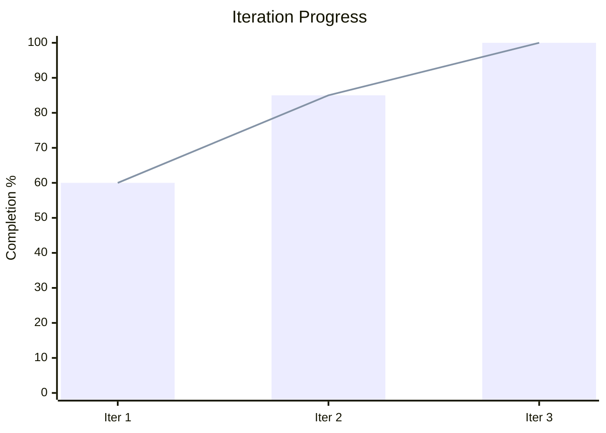
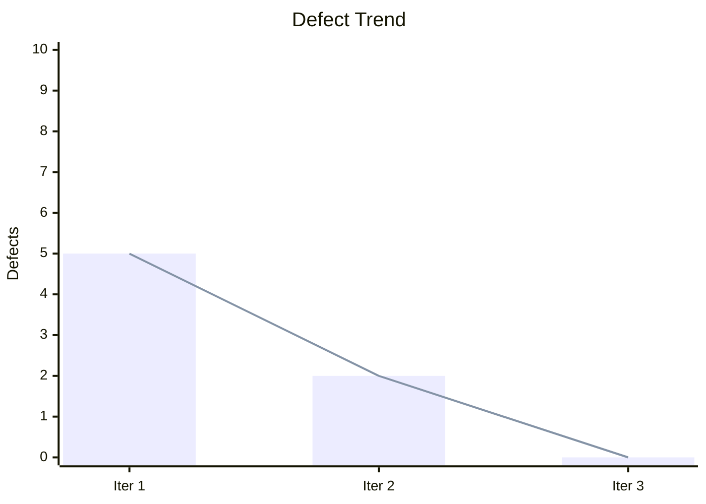
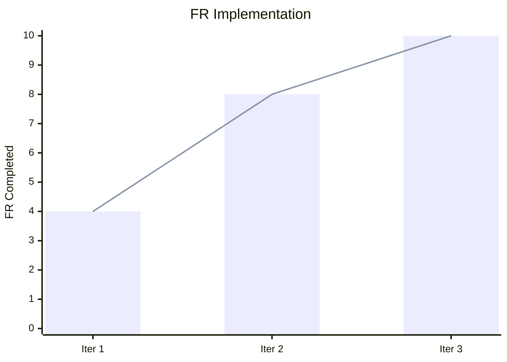

# {{PROJECT_NAME}} Iteration Log

## 1. Background

### 1.1 Purpose

{{Iteration 로그 문서의 목적. 각 Iteration의 진행 이력과 결과를 기록한다.}}

### 1.2 Current State

| Metric | Value |
|--------|-------|
| Total Iterations | {{TOTAL}} |
| Current Iteration | {{CURRENT}} |
| Overall Progress | {{PROGRESS}}% |

---

## 2. Iteration History

| Iteration | Start Date | End Date | Phase Reached | Result | Backlog In | Backlog Out | FR Progress |
|-----------|-----------|---------|---------------|--------|-----------|------------|------------|
| Iter 1 | {{DATE}} | {{DATE}} | CHECK | Fail | 0 | 3 | 60% |
| Iter 2 | {{DATE}} | - | - | In Progress | 3 | - | - |

---

## 3. Progress Chart

---

## 4. Iteration Details

### 4.1 Iteration 1

| Field | Value |
|-------|-------|
| **Start Date** | {{DATE}} |
| **End Date** | {{DATE}} |
| **Phase Reached** | CHECK |
| **Result** | Fail |

**Exit Criteria Check**:

| # | Criteria | Result |
|---|---------|--------|
| 1 | Backlog all Done | FAIL (3 open) |
| 2 | No Critical/Major | FAIL (1 Critical) |
| 3 | All FR implemented | FAIL (2 remaining) |
| 4 | Build success | PASS |

**Phase Summary**:

| Phase | Duration | Output | Notes |
|-------|---------|--------|-------|
| PLAN | 2d | Roadmap, SRS, IA, Index | All Final |
| DESIGN | 3d | Screen, ERD, API | All Final |
| DO | 5d | Frontend, Backend, Code Record | Build success |
| CHECK | 2d | Test Cases, QA Report | 3 defects found |
| ACT | 1d | Backlog, Iteration Log, Retrospective | 3 items in backlog |

**Changes Made**:
- {{변경 사항 1}}
- {{변경 사항 2}}

**Backlog Generated**:
- BL-0010: {{설명}} (Critical)
- BL-0020: {{설명}} (Major)
- BL-0030: {{설명}} (Minor)

### 4.2 Iteration 2

| Field | Value |
|-------|-------|
| **Start Date** | {{DATE}} |
| **End Date** | - |
| **Phase Reached** | - |
| **Result** | In Progress |
| **Focus** | BL-0010 (Critical), BL-0020 (Major) |

**Changes Made**:
- {{변경 사항}}

---

## 5. Metrics Over Time

### 5.1 Defect Trend

### 5.2 FR Implementation Progress

---

## 6. Archive Index

| Iteration | Archive Path | Date |
|-----------|-------------|------|
| Iter 1 | `u-docs/iterations/iter-1/` | {{DATE}} |

---

## Change Log

| Version | Date | Author | Description |
|---------|------|--------|-------------|
| v0.1.0 | {{DATE}} | u-RA | Initial iteration log |
