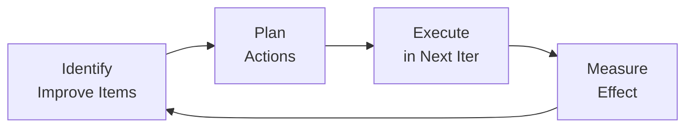
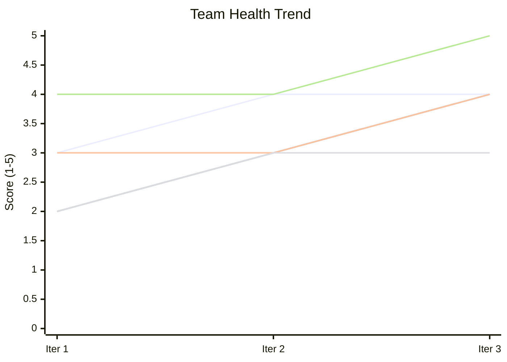

# {{PROJECT_NAME}} Retrospective

## 1. Background

### 1.1 Purpose

{{회고 문서의 목적. 각 Iteration의 성과를 돌아보고 개선 사항을 도출한다.}}

### 1.2 Context

| Item | Value |
|------|-------|
| Iteration | {{ITERATION}} |
| Date | {{DATE}} |
| Phase Reached | {{PHASE}} |
| Result | {{RESULT}} |

---

## 2. Iteration {{N}} Retrospective

### 2.1 Good (잘한 점)

| # | Category | Description |
|---|----------|-------------|
| G-001 | Process | {{잘한 점}} |
| G-002 | Quality | {{잘한 점}} |
| G-003 | Collaboration | {{잘한 점}} |

### 2.2 Improve (개선할 점)

| # | Category | Description | Impact |
|---|----------|-------------|--------|
| I-001 | Process | {{개선할 점}} | High |
| I-002 | Quality | {{개선할 점}} | Medium |
| I-003 | Efficiency | {{개선할 점}} | Low |

### 2.3 Actions (실행 항목)

| # | Action | Owner | Target Iteration | Status |
|---|--------|-------|-----------------|--------|
| A-001 | {{실행 항목}} | {{담당}} | Iter {{N+1}} | Planned |
| A-002 | {{실행 항목}} | {{담당}} | Iter {{N+1}} | Planned |
| A-003 | {{실행 항목}} | {{담당}} | Iter {{N+1}} | Planned |

---

## 3. Improvement Cycle

---

## 4. Retrospective History

### 3.1 Iteration 1

**Good**:
- {{잘한 점 요약}}

**Improve**:
- {{개선할 점 요약}}

**Actions Taken**:
- {{실행 결과}}

### 3.2 Iteration 2

**Good**:
- {{잘한 점 요약}}

**Improve**:
- {{개선할 점 요약}}

**Actions Taken**:
- {{실행 결과}}

---

## 5. Action Items Tracking

| A-ID | Action | Origin Iter | Target Iter | Owner | Status |
|------|--------|------------|------------|-------|--------|
| A-001 | {{실행 항목}} | Iter 1 | Iter 2 | {{담당}} | Done |
| A-002 | {{실행 항목}} | Iter 1 | Iter 2 | {{담당}} | In Progress |
| A-003 | {{실행 항목}} | Iter 2 | Iter 3 | {{담당}} | Planned |

---

## 6. Team Health

| Category | Iter 1 | Iter 2 | Iter 3 | Trend |
|----------|--------|--------|--------|-------|
| Process Adherence | {{1-5}} | {{1-5}} | {{1-5}} | {{up/down/same}} |
| Document Quality | {{1-5}} | {{1-5}} | {{1-5}} | {{up/down/same}} |
| Code Quality | {{1-5}} | {{1-5}} | {{1-5}} | {{up/down/same}} |
| Test Coverage | {{1-5}} | {{1-5}} | {{1-5}} | {{up/down/same}} |
| Collaboration | {{1-5}} | {{1-5}} | {{1-5}} | {{up/down/same}} |

---

## 7. Lessons Learned

| # | Lesson | Applied From |
|---|--------|-------------|
| L-001 | {{교훈}} | Iter {{N}} |
| L-002 | {{교훈}} | Iter {{N}} |

---

## Change Log

| Version | Date | Author | Description |
|---------|------|--------|-------------|
| v0.1.0 | {{DATE}} | u-RA | Iteration {{N}} retrospective |
