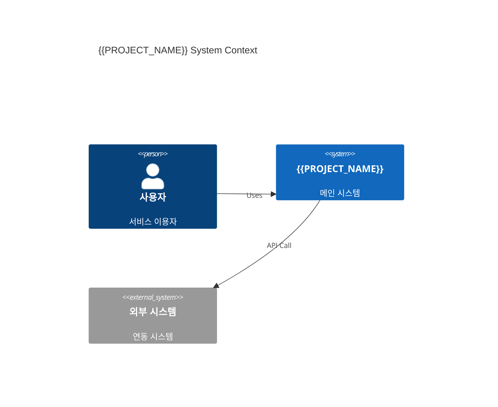

# {{PROJECT_NAME}} 시스템 구성도

## 1. 전체 아키텍처

## 2. 앱 구성
| 앱 | 유형 | 설명 | 기술 스택 |
|----|------|------|-----------|

## 3. 인프라 구성
## 4. 통신 구조
## 5. 배포 환경
| 환경 | URL | 용도 |
|------|-----|------|
| Development | | 개발 |
| Staging | | QA |
| Production | | 운영 |

## 6. Change Log
| Version | Date | Author | Description |
|---------|------|--------|-------------|
